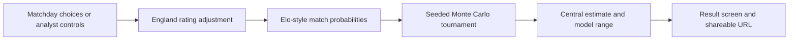
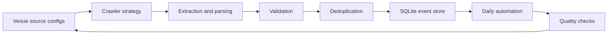
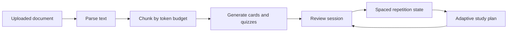
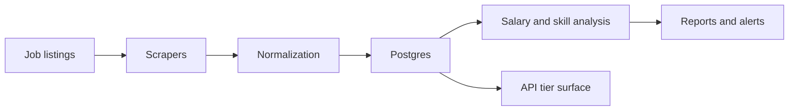
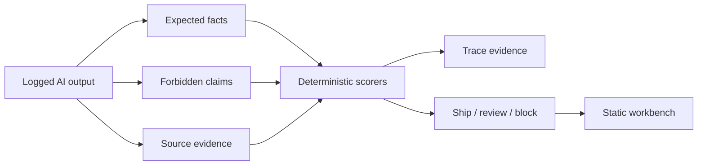

# Case Studies

Product and engineering notes from selected builds across automation, data, AI, and analytics.

[Back to Profile](README.md) | [Portfolio Store](https://matthewpaver.github.io/MatthewPaver/store/) | [Project Appendix](Projects.md)

Private and professional examples are anonymised. Public builds link to the working product and source.

---

## How To Read These

Start with the project that matches what you want to inspect. Each note covers the problem, decisions, tradeoffs, result, and implementation.

| Case study | Best signal |
|:---|:---|
| [Can England Win It?](#product-case-study-can-england-win-it) | Public product design, explainable simulation, and shareable scenarios |
| [Featured Build: Happening](#featured-build-happening) | Reliable ingestion from fragmented public web sources |
| [AI Workflow Evaluator](#ai-workflow-evaluator) | AI Ops gates for quality, cost, routing, and review |
| [AI Study Companion](#ai-study-companion) | Document AI, async jobs, and adaptive learning loops |
| [Smart Job Market Intelligence](#smart-job-market-intelligence) | Repeatable market intelligence product from scraped listings |

---

## Product Case Study: Can England Win It?

**Type:** Live public product

[Open product](https://matthewpaver.github.io/can-england-win-it/) | [Inspect source](https://github.com/MatthewPaver/can-england-win-it)

### Problem

Tournament probabilities usually arrive as a single percentage. That number is hard to question because the assumptions sit somewhere else, if they are published at all. I wanted to make the probability explorable without turning the experience into a spreadsheet.

### Product Decisions

- **Start with three matchday choices.** A short path gets someone to a result quickly. Analyst mode keeps the four detailed controls available without making them the front door.
- **Show the model boundary.** The app labels its ratings and player boosts as illustrative. It describes the result as a scenario, not a forecast or betting claim.
- **Keep the calculation in the browser.** The static build has no account, database, or backend dependency. Anyone can open it from GitHub Pages and run the same model.
- **Make every result repeatable.** A seeded simulation gives the same output for the same inputs. The URL carries the scenario so another person can open and challenge it.
- **Give the result a proper finish.** A full-screen tournament sequence turns the calculation into a product moment, then returns to the probability, range, and assumptions.

### Trade-offs

The team ratings in `src/model.ts` are isolated and replaceable, but they are not a live forecasting feed. The player choice adds an entertainment boost rather than a measured player statistic. Those limits keep the product honest, though they also mean the result cannot claim predictive accuracy.

Ten thousand runs give a stable result while keeping the simulation immediate on a phone or laptop. A seeded generator reduces random variation between visits, which helps sharing and testing, but it also means rerunning an unchanged scenario will not produce a fresh sample.

### Result

The shipped product runs **10,000 tournament simulations** for each scenario, exposes a central estimate and illustrative range, and supports shareable URLs. It has a responsive, keyboard-friendly interface, six simulation tests, and an automated GitHub Pages deployment.

**Stack:** `React` `TypeScript` `Vite` `Vitest` `GitHub Pages`

---

## Featured Build: Happening

**Problem:** London event data looks simple from the outside, but the source material is messy: venue pages change structure, dates and prices are inconsistent, images go missing, and the same event can appear in more than one place.

**Constraints:** the system needed to handle many public sources without exposing private operational details, stay cheap to run, make failures visible, and let new sources be added without rewriting the pipeline each time.

**Decisions:** I treated each venue as an explicit source configuration, separated crawling from extraction and normalisation, kept SQLite as the reliable local store, and made source quality visible through checks rather than hiding scrape failures in logs.

**Tradeoffs:** deterministic rules are less glamorous than an all-LLM scraper, but they are easier to debug, test, and operate. Playwright is heavier than plain HTTP, but it handles modern venue sites that render useful content client-side.

**Result:** the system maps **103+ venue sources** into structured event data, with dedupe, validation, source-level quality checks, and a **167-test** reliability suite. The important part is not just collecting events; it is knowing when the data path is healthy.

**Stack:** `Python` `Playwright` `SQLite` `Pydantic` `Next.js`

---

## Happening

**Type:** Private system  
**Problem:** Event listings are fragmented across many sites with inconsistent formats and update patterns.  
**Goal:** Build a repeatable daily ingestion system with reliable normalisation and storage.

### What I Built

- Source configuration for **103 venues**
- Multi-strategy crawling with Playwright-backed extraction
- Structured validation using Pydantic-style schemas
- Deduplication and normalisation before SQLite persistence
- Daily automation workflow
- **167-test** suite covering adapters and pipeline reliability

**Engineering signal:** reliability, explicit source behaviour, and safe iteration under test coverage.  
**Stack:** `Python` `Playwright` `SQLite` `Pydantic` `GitHub Actions`

---

## AI Study Companion

**Type:** Private product  
**Problem:** Learners have long documents but weak active-recall workflows.  
**Goal:** Convert documents into flashcards, quizzes, and adaptive study plans.

### What I Built

- PDF, DOCX, and text ingestion paths
- Token-aware chunking before LLM generation
- Flashcard, quiz, and study-plan generation
- SM-2 style spaced-repetition loop
- Async generation jobs
- Auth, tiers, rate limits, billing boundaries, and export paths
- Local or hosted LLM provider support

**Engineering signal:** product-grade pipeline design, not just prompt orchestration.  
**Stack:** `Python` `FastAPI` `PostgreSQL` `Redis` `Celery`

---

## Smart Job Market Intelligence

**Type:** Private system  
**Problem:** Job posting data is high-volume, messy, and constantly changing.  
**Goal:** Build a repeatable intelligence product for trends, insights, and alerting.

### What I Built

- Scraping and ingestion layer for listings
- Salary and skill trend analysis
- Posting volume and remote-ratio tracking
- Alerting workflows
- API surface with tier and rate-limit design
- Background processing architecture

**Engineering signal:** repeatable data-product architecture over one-off analysis.  
**Stack:** `Python` `FastAPI` `PostgreSQL` `Redis` `Celery`

---

## AI Workflow Evaluator

**Type:** Public repo
**Problem:** AI-generated summaries can sound polished while quietly overclaiming, missing required facts, citing weak evidence, or skipping review. Generic "looks good" checks are not enough when the output is going into a product, portfolio, or operational workflow.

**Goal:** Build a small, runnable regression test for logged AI outputs. Given the model answer, allowed evidence, blocked claims, cost limits, latency limits, and review status, the tool should return a practical decision: ship, review, block, or reroute.

### What I Built

- Deterministic scoring for required facts, source grounding, blocked claims, latency, token cost, multimodal cost, and review status
- Routing recommendations for cheap model, stronger model, human review, context retrieval, input compression, async queueing, or block/rewrite
- Dataset and scorer version metadata in every report
- Baseline deltas so a run can be compared against the previous accepted state
- Trace-level explanations for why an output shipped, needs review, or was blocked
- A portfolio-grounding suite that checks repo summary copy against README-style evidence
- Static dashboard, tests, CI, and GitHub Pages demo

### Before / After

| Stage | Example |
|:---|:---|
| **Before** | "This is a deployed dating-app recommender used in production with online feedback loops." |
| **Evaluator catches** | Forbidden claims: `deployed dating-app recommender`, `used in production`, `online feedback loops`; missing evidence for production usage; weak grounding against the source notes |
| **After** | "Offline recommendation exercise using swipe-style implicit feedback, temporal holdouts, and Top-K metrics." |

### Architecture

**Tradeoffs:** deterministic checks are narrower than semantic evals or LLM-as-judge workflows, but they are cheap, reproducible, easy to inspect, and useful when the expected evidence is known. Production use would still need auth, trace storage, provider telemetry, and human review workflows.

**Engineering signal:** evaluation discipline, not just prompt writing. The project shows how I think about AI reliability: evidence first, visible criteria, labelled expectations, and explicit limitations.

**Stack:** `Python` `HTML` `CSS` `JavaScript` `GitHub Actions`
[Repo](https://github.com/MatthewPaver/ai-workflow-evaluator) · [Live demo](https://matthewpaver.github.io/ai-workflow-evaluator/app/)

---

## Public Portfolio Notes

Public repositories back up the same themes:

| Repo | Portfolio role |
|:---|:---|
| [Marketing ML Lakehouse](https://github.com/MatthewPaver/marketing-ml-lakehouse) | Data engineering + ML workflow |
| [ProjectLens](https://github.com/MatthewPaver/ProjectLens) | Analytics application + project-risk reporting |
| [AI Workflow Evaluator](https://github.com/MatthewPaver/ai-workflow-evaluator) | AI reliability + deterministic eval workbench |
| [Architexa](https://github.com/MatthewPaver/Architexa) | Model training + image generation + API integration |
| [Dating App Recommendation System](https://github.com/MatthewPaver/dating-app-recommendation-system) | Practical recommendation modelling |
| [Sentence Similarity Analysis](https://github.com/MatthewPaver/sentence-similarity-analysis) | Embedding-based retrieval patterns |
| [PySpark Kafka Streaming](https://github.com/MatthewPaver/pyspark-kafka-streaming) | Streaming data foundations |
