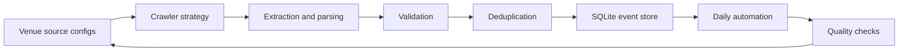
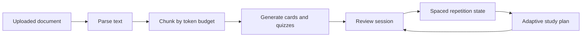
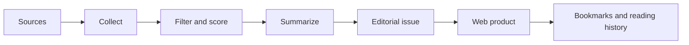
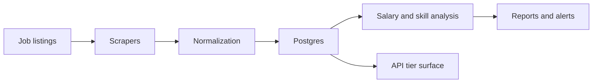

# Case Studies

Short, sanitised case studies across AI, data, automation, and analytics.

[Back to Profile](README.md) | [Portfolio Store](https://matthewpaver.github.io/MatthewPaver/store/) | [Project Appendix](Projects.md)

All professional examples are intentionally anonymised and focused on architecture, tradeoffs, and delivery patterns rather than internal identifiers.

---

## How To Read These

Each case study is deliberately short: problem, goal, what I built, architecture, engineering signal, and stack. The point is to show product judgment and system design without exposing private repo contents or professional identifiers.

| Case study | Best signal |
|:---|:---|
| [Featured Build: Happening](#featured-build-happening) | Reliable ingestion from fragmented public web sources |
| [Inference Brief](#inference-brief) | Live AI product plus publishing workflow |
| [AI Study Companion](#ai-study-companion) | Document AI, async jobs, and adaptive learning loops |
| [Smart Job Market Intelligence](#smart-job-market-intelligence) | Repeatable market intelligence product from scraped listings |

---

## Featured Build: Happening

**Problem:** London event data looks simple from the outside, but the source material is messy: venue pages change structure, dates and prices are inconsistent, images go missing, and the same event can appear in more than one place.

**Constraints:** the system needed to handle many public sources without exposing private operational details, stay cheap to run, make failures visible, and let new sources be added without rewriting the pipeline each time.

**Decisions:** I treated each venue as an explicit source configuration, separated crawling from extraction and normalisation, kept SQLite as the reliable local store, and made source quality visible through checks rather than hiding scrape failures in logs.

**Tradeoffs:** deterministic rules are less glamorous than an all-LLM scraper, but they are easier to debug, test, and operate. Playwright is heavier than plain HTTP, but it handles modern venue sites that render useful content client-side.

**Result:** the system maps **103+ venue sources** into structured event data, with dedupe, validation, source-level quality checks, and a **167-test** reliability suite. The important part is not just collecting events; it is knowing when the data path is healthy.

**Stack:** `Python` `Playwright` `SQLite` `Pydantic` `Next.js`

---

## Happening

**Type:** Private system  
**Problem:** Event listings are fragmented across many sites with inconsistent formats and update patterns.  
**Goal:** Build a repeatable daily ingestion system with reliable normalisation and storage.

### What I Built

- Source configuration for **103 venues**
- Multi-strategy crawling with Playwright-backed extraction
- Structured validation using Pydantic-style schemas
- Deduplication and normalisation before SQLite persistence
- Daily automation workflow
- **167-test** suite covering adapters and pipeline reliability

**Engineering signal:** reliability, explicit source behaviour, and safe iteration under test coverage.  
**Stack:** `Python` `Playwright` `SQLite` `Pydantic` `GitHub Actions`

---

## AI Study Companion

**Type:** Private product  
**Problem:** Learners have long documents but weak active-recall workflows.  
**Goal:** Convert documents into flashcards, quizzes, and adaptive study plans.

### What I Built

- PDF, DOCX, and text ingestion paths
- Token-aware chunking before LLM generation
- Flashcard, quiz, and study-plan generation
- SM-2 style spaced-repetition loop
- Async generation jobs
- Auth, tiers, rate limits, billing boundaries, and export paths
- Local or hosted LLM provider support

**Engineering signal:** product-grade pipeline design, not just prompt orchestration.  
**Stack:** `Python` `FastAPI` `PostgreSQL` `Redis` `Celery`

---

## Inference Brief

**Type:** Live product  
**Problem:** AI news moves quickly, repeats across sources, and often rewards scrolling rather than useful reading. The product challenge was to make the workflow feel calm: collect enough signal, shape it into a briefing, and give readers a place to return to.

**Constraints:** the product needed to stay lightweight, publish consistently, support account-level reading features, and avoid becoming a static newsletter archive. It also had to separate editorial judgement from automation so the output could be reviewed before it reached readers.

**Decisions:** I built it as a product loop rather than a content dump: source collection, filtering, scoring, summarisation, issue assembly, publishing, reader accounts, bookmarks, history, and preferences. The product surface matters because the user job is not just "read AI news"; it is "stay current without losing the thread."

**Tradeoffs:** full automation would be faster, but it risks publishing weak summaries or duplicate stories. A curated pipeline is slower, but easier to check and improve. Keeping the live product focused also means not adding every possible news feature until the reading loop is solid.

**Result:** Inference Brief is live at [inferencebrief.co](https://inferencebrief.co/) with a working reader experience, account flows, issue archive, bookmarking, reading history, and an editorial publishing workflow.

**What changed after shipping:** the store and profile now frame it as a product with a workflow, not just a newsletter. That is the right signal: the build is about turning noisy sources into a repeatable reader experience.

### Product Shape

- Source collection and filtering
- Story scoring and summarisation
- Issue assembly and publishing
- Account-based reader experience
- Bookmarks, reading history, archive, and preferences
- Subscription boundary for future product growth

**Engineering signal:** combines editorial judgment, automation, and product UX into a reusable publishing loop.

**Stack:** `Next.js` `TypeScript` `Supabase` `Python` `Stripe`  
[Live site](https://inferencebrief.co/)

---

## Smart Job Market Intelligence

**Type:** Private system  
**Problem:** Job posting data is high-volume, messy, and constantly changing.  
**Goal:** Build a repeatable intelligence product for trends, insights, and alerting.

### What I Built

- Scraping and ingestion layer for listings
- Salary and skill trend analysis
- Posting volume and remote-ratio tracking
- Alerting workflows
- API surface with tier and rate-limit design
- Background processing architecture

**Engineering signal:** repeatable data-product architecture over one-off analysis.  
**Stack:** `Python` `FastAPI` `PostgreSQL` `Redis` `Celery`

---

## Public Portfolio Notes

Public repositories provide runnable proof across the same themes:

| Repo | Portfolio role |
|:---|:---|
| [Marketing ML Lakehouse](https://github.com/MatthewPaver/marketing-ml-lakehouse) | Data engineering + ML workflow |
| [ProjectLens](https://github.com/MatthewPaver/ProjectLens) | Analytics application + project-risk reporting |
| [Architexa](https://github.com/MatthewPaver/Architexa) | Model training + image generation + API integration |
| [Dating App Recommendation System](https://github.com/MatthewPaver/dating-app-recommendation-system) | Practical recommendation modelling |
| [Sentence Similarity Analysis](https://github.com/MatthewPaver/sentence-similarity-analysis) | Embedding-based retrieval patterns |
| [PySpark Kafka Streaming](https://github.com/MatthewPaver/pyspark-kafka-streaming) | Streaming data foundations |
