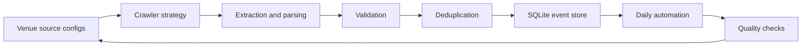
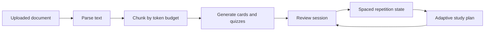
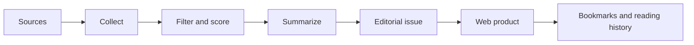
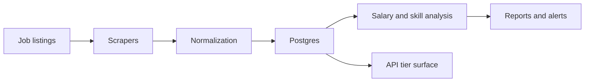

# Case Studies

Short, sanitised case studies across AI, data, automation, and analytics.

[Back to Profile](README.md) | [Portfolio Store](https://matthewpaver.github.io/MatthewPaver/store/) | [Project Index](Projects.md)

All professional examples are intentionally anonymised and focused on architecture, tradeoffs, and delivery patterns rather than internal identifiers.

---

## How To Read These

Each case study is deliberately short: problem, goal, what I built, architecture, engineering signal, and stack. The point is to show product judgment and system design without exposing private repo contents or professional identifiers.

| Case study | Best signal |
|:---|:---|
| [Happening](#happening) | Reliable ingestion from fragmented public web sources |
| [Inference Brief](#inference-brief) | Live AI product plus publishing workflow |
| [AI Study Companion](#ai-study-companion) | Document AI, async jobs, and adaptive learning loops |
| [Smart Job Market Intelligence](#smart-job-market-intelligence) | Repeatable market intelligence product from scraped listings |

---

## Happening

**Type:** Private system  
**Problem:** Event listings are fragmented across many sites with inconsistent formats and update patterns.  
**Goal:** Build a repeatable daily ingestion system with reliable normalisation and storage.

### What I Built

- Source configuration for **103 venues**
- Multi-strategy crawling with Playwright-backed extraction
- Structured validation using Pydantic-style schemas
- Deduplication and normalisation before SQLite persistence
- Daily automation workflow
- **167-test** suite covering adapters and pipeline reliability

**Engineering signal:** reliability, explicit source behaviour, and safe iteration under test coverage.  
**Stack:** `Python` `Playwright` `SQLite` `Pydantic` `GitHub Actions`

---

## AI Study Companion

**Type:** Private product  
**Problem:** Learners have long documents but weak active-recall workflows.  
**Goal:** Convert documents into flashcards, quizzes, and adaptive study plans.

### What I Built

- PDF, DOCX, and text ingestion paths
- Token-aware chunking before LLM generation
- Flashcard, quiz, and study-plan generation
- SM-2 style spaced-repetition loop
- Async generation jobs
- Auth, tiers, rate limits, billing boundaries, and export paths
- Local or hosted LLM provider support

**Engineering signal:** product-grade pipeline design, not just prompt orchestration.  
**Stack:** `Python` `FastAPI` `PostgreSQL` `Redis` `Celery`

---

## Inference Brief

**Type:** Live product  
**Problem:** AI news is noisy and difficult to convert into a consistent reading workflow.  
**Goal:** Build a curated briefing pipeline and personalised reading experience.

### What I Built

- Weekly publishing workflow
- Collection, filtering, scoring, summarisation, and issue assembly pipeline
- Personalised web experience
- Bookmarks, reading history, issue archive, and topic preferences
- Subscription and account flows

**Engineering signal:** combines editorial judgment with automation into a reusable product loop.  
**Stack:** `Next.js` `TypeScript` `Supabase` `Python` `Stripe`  
[Live site](https://inferencebrief.co/)

---

## Smart Job Market Intelligence

**Type:** Private system  
**Problem:** Job posting data is high-volume, messy, and constantly changing.  
**Goal:** Build a repeatable intelligence product for trends, insights, and alerting.

### What I Built

- Scraping and ingestion layer for listings
- Salary and skill trend analysis
- Posting volume and remote-ratio tracking
- Alerting workflows
- API surface with tier and rate-limit design
- Background processing architecture

**Engineering signal:** repeatable data-product architecture over one-off analysis.  
**Stack:** `Python` `FastAPI` `PostgreSQL` `Redis` `Celery`

---

## Public Portfolio Notes

Public repositories provide runnable proof across the same themes:

| Repo | Portfolio role |
|:---|:---|
| [Marketing ML Lakehouse](https://github.com/MatthewPaver/marketing-ml-lakehouse) | Data engineering + ML workflow |
| [ProjectLens](https://github.com/MatthewPaver/ProjectLens) | Analytics application + project-risk reporting |
| [Architexa](https://github.com/MatthewPaver/Architexa) | Model training + image generation + API integration |
| [Dating App Recommendation System](https://github.com/MatthewPaver/dating-app-recommendation-system) | Practical recommendation modelling |
| [Sentence Similarity Analysis](https://github.com/MatthewPaver/sentence-similarity-analysis) | Embedding-based retrieval patterns |
| [PySpark Kafka Streaming](https://github.com/MatthewPaver/pyspark-kafka-streaming) | Streaming data foundations |
