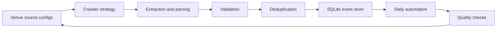
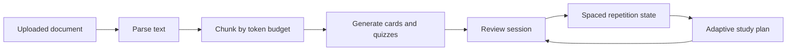
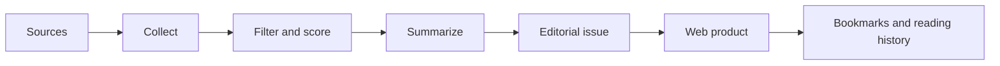
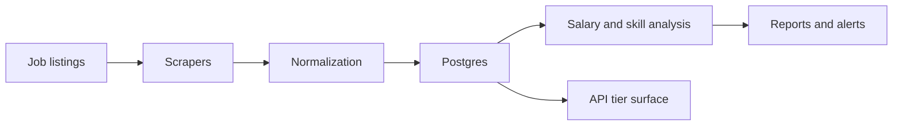

# Case Studies

These are short, sanitized summaries of systems I have been building across AI, data, automation, and analytics. Some code is private, but the architecture, tradeoffs, and engineering patterns are representative.

[Back to Profile](README.md) | [Project Index](Projects.md)

---

## Happening

**Type:** Private system  
**Problem:** Event listings are spread across venue sites with inconsistent HTML, date formats, ticket links, and update patterns.  
**Goal:** Build a repeatable ingestion system that can collect, normalize, deduplicate, and store London event data every day.

### What I Built

- Source configuration for **103 London venues**
- Multi-strategy crawling with Playwright-backed extraction
- Structured event validation using Pydantic-style schemas
- Deduplication and normalization before SQLite persistence
- Daily automation workflow
- **167-test** suite covering adapters, agents, source behavior, and pipeline reliability

### Engineering Signal

The important part is not just scraping pages. It is making source behavior explicit, turning unpredictable HTML into structured records, and building enough tests around the system that changes can be made without guessing.

**Stack:** `Python` `Playwright` `SQLite` `Pydantic` `GitHub Actions`

---

## AI Study Companion

**Type:** Private product  
**Problem:** Students often have long PDFs, notes, and revision material but no quick way to turn them into active recall workflows.  
**Goal:** Build a full-stack study tool that converts documents into flashcards, quizzes, and adaptive study plans.

### What I Built

- PDF, DOCX, and text ingestion paths
- Token-aware chunking before LLM generation
- Flashcard, quiz, and study-plan generation
- Spaced repetition based on SM-2 style review loops
- Async generation jobs
- Auth, tiers, rate limits, billing boundaries, and export paths
- Local or hosted LLM provider support

### Engineering Signal

This is a product-shaped AI system: parsing and chunking matter as much as model calls, background jobs need clean status tracking, and the learning loop has to persist user progress over time.

**Stack:** `Python` `FastAPI` `PostgreSQL` `Redis` `Celery`

---

## Inference Brief

**Type:** Live product  
**Problem:** AI news is noisy, repetitive, and hard to turn into a useful weekly reading habit.  
**Goal:** Build a briefing product with a curated editorial pipeline and a personalized reading surface.

### What I Built

- Weekly publishing workflow
- Collection, filtering, scoring, summarization, and issue assembly pipeline
- Personalized web experience
- Bookmarks, reading history, issue archive, and topic preferences
- Subscription and account flows

### Engineering Signal

The product combines editorial judgment with automation. The point is not to publish more content; it is to make a smaller amount of better-filtered information easier to read and return to.

**Stack:** `Next.js` `TypeScript` `Supabase` `Python` `Stripe`

[Live site](https://inferencebrief.co/)

---

## Smart Job Market Intelligence

**Type:** Private system  
**Problem:** Job postings contain useful signals about salary, skills, remote work, and demand trends, but the data is messy and changes constantly.  
**Goal:** Build a job-market intelligence product around scraping, analysis, alerts, and product-style API tiers.

### What I Built

- Scraping and ingestion layer for job listings
- Salary and skill trend analysis
- Posting volume and remote-ratio tracking
- Alerting workflows
- API routes with tier and rate-limit thinking
- Background processing architecture

### Engineering Signal

This is a data product rather than a one-off scrape. The value comes from repeatability, trend tracking, and turning changing public data into useful signals.

**Stack:** `Python` `FastAPI` `PostgreSQL` `Redis` `Celery`

---

## Public Portfolio Notes

The public repositories provide runnable proof around the same themes:

| Repo | Portfolio role |
|:---|:---|
| [Marketing ML Lakehouse](https://github.com/MatthewPaver/marketing-ml-lakehouse) | Data engineering plus ML workflow |
| [ProjectLens](https://github.com/MatthewPaver/ProjectLens) | Analytics application and project-risk reporting |
| [Architexa](https://github.com/MatthewPaver/Architexa) | Model training, image generation, and API integration |
| [Dating App Recommendation System](https://github.com/MatthewPaver/dating-app-recommendation-system) | Practical recommendation-system modelling |
| [Sentence Similarity Analysis](https://github.com/MatthewPaver/sentence-similarity-analysis) | Embedding-based retrieval thinking |
| [PySpark Kafka Streaming](https://github.com/MatthewPaver/pyspark-kafka-streaming) | Streaming-data foundations |
