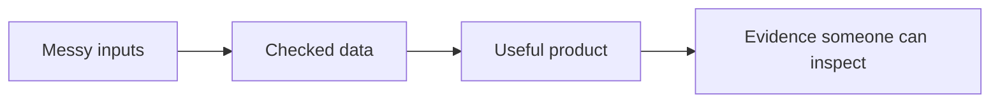

# Matthew Paver

### AI products, data systems, and useful analytics

I build practical software around messy information: crawled websites, scraped listings, raw CSVs, notes, schedules, dashboards, and recommendation data. The work usually sits where AI, data, and product design meet: collect the signal, check it, and turn it into something someone can open.

  
  
  
  
  

  
  
  
  
  
  
  

---

## Portfolio Map

| Shelf | Best first | Why it matters |
|:---|:---|:---|
| [Products](https://matthewpaver.github.io/MatthewPaver/store/?filter=product) | Inference Brief, QuickSupply | Real workflows with users, state, and decisions |
| [Data systems](https://matthewpaver.github.io/MatthewPaver/store/?filter=data) | Happening, Marketing ML Lakehouse | Messy sources turned into repeatable pipelines |
| [Automation](https://matthewpaver.github.io/MatthewPaver/store/?filter=automation) | Happening, Smart Job Market Intelligence | Scheduled jobs, checks, and operational handoff |
| [ML and retrieval](https://matthewpaver.github.io/MatthewPaver/store/?filter=ml) | Recommendation System, Sentence Similarity | Ranking, embeddings, evaluation, and model packaging |
| [Analytics](https://matthewpaver.github.io/MatthewPaver/store/?filter=analytics) | ProjectLens, HR Performance Analytics | Analysis packaged as tools and dashboards people can use |

## Start Here

| If you want | Open | What it shows |
|:---|:---|:---|
| The best visual overview | [Portfolio Store](https://matthewpaver.github.io/MatthewPaver/store/) | App-store style previews across products, data systems, ML, analytics, credentials, and archive work |
| A live product | [Inference Brief](https://inferencebrief.co/) | A working AI-news reader with collection, scoring, publishing, accounts, bookmarks, and history |
| The private build story | [Case Studies](CASE_STUDIES.md) | How the larger private systems are designed without exposing private code |
| A full appendix | [Project Index](Projects.md) | Public, private, live, and archived work in one place |

## Featured Builds

<table>
<tr>
<td width="33%" valign="top">
  
  <h3>Inference Brief</h3>
  
A live reader for keeping up with AI without chasing noisy feeds. The product wraps collection, scoring, summaries, publishing, bookmarks, preferences, and reading history into one workflow.

  
<code>Next.js</code> <code>TypeScript</code> <code>Supabase</code> <code>Python</code>

  
<a href="https://matthewpaver.github.io/MatthewPaver/store/preview.html?app=inference">Open preview</a> · <a href="https://inferencebrief.co/">Live product</a>

</td>
<td width="33%" valign="top">
  
  <h3>Happening</h3>
  
A private event-data system for London venues. It turns inconsistent source pages into checked event data using configured crawling, extraction, dedupe, validation, and regression tests.

  
<code>Python</code> <code>Playwright</code> <code>SQLite</code> <code>Pydantic</code>

  
<a href="https://matthewpaver.github.io/MatthewPaver/store/preview.html?app=happening">Open preview</a> · <a href="CASE_STUDIES.md#featured-build-happening">Case study</a>

</td>
<td width="33%" valign="top">
  
  <h3>QuickSupply</h3>
  
A supply-cover workflow for schools, agencies, and teachers. It models requests, assignment, availability, compliance, offers, and live booking status as one operational flow.

  
<code>Next.js</code> <code>TypeScript</code> <code>Drizzle</code> <code>SSE</code>

  
<a href="https://matthewpaver.github.io/MatthewPaver/store/preview.html?app=quicksupply">Open preview</a>

</td>
</tr>
</table>

## Public Repos Worth Opening

| Repo | Why it is useful | Signals |
|:---|:---|:---|
| [Marketing ML Lakehouse](https://github.com/MatthewPaver/marketing-ml-lakehouse) | Local analytics loop from raw marketing CSVs to DuckDB, XGBoost, checks, and Streamlit | Run locally, tests, dashboard |
| [ProjectLens](https://github.com/MatthewPaver/ProjectLens) | Schedule-risk app for slippage, milestone pressure, and reporting outputs | Upload flow, tests, Power BI-ready outputs |
| [Dating App Recommendation System](https://github.com/MatthewPaver/dating-app-recommendation-system) | Ranking project focused on implicit feedback, temporal holdouts, and Top-K evaluation | Demo data, tests, CLI shape |
| [HR Performance Analytics](https://github.com/MatthewPaver/hr-performance-dashboards) | Dashboard handoff package with PBIX files, screenshots, data, and business commentary | PBIX files, screenshots, prepared data |

---

## Credentials

<table>
<tr>
<td width="25%" valign="top"><strong>Cloud</strong></td>
<td width="75%" valign="top">
  
   
  Verified foundation in cloud architecture and services.
</td>
</tr>
<tr>
<td width="25%" valign="top"><strong>AI and data</strong></td>
<td width="75%" valign="top">
  
  
  
   
  AI fundamentals, graph data modelling, agent workflows, and evaluation.
</td>
</tr>
<tr>
<td width="25%" valign="top"><strong>Automation</strong></td>
<td width="75%" valign="top">
  
   
  Automation and RPA delivery.
</td>
</tr>
<tr>
<td width="25%" valign="top"><strong>Professional IT</strong></td>
<td width="75%" valign="top">
  
  
   
  Professional IT foundations and core systems practice.
</td>
</tr>
<tr>
<td width="25%" valign="top"><strong>Background</strong></td>
<td width="75%" valign="top">
  
   
  Full background and experience.
</td>
</tr>
</table>

---

## How To Read This

The [Portfolio Store](https://matthewpaver.github.io/MatthewPaver/store/) is the front door. The README stays deliberately lean; the store does the visual showing-off. The store is backed by a small [app index](store/app-index.csv) and deploy-time checks, so new projects have to carry a preview, shelf, status, proof point, stack, and asset. The [case studies](CASE_STUDIES.md) explain the bigger private systems, and [Projects.md](Projects.md) is the full appendix when someone wants every public, private, live, and archived item.

## Contact

Interested in AI/data products, automation systems, and operational tooling. Best place to reach me is [LinkedIn](https://www.linkedin.com/in/matthew-paver-534262166/).

Latest public activity

<!-- AUTO:ACTIVITY_START -->
## Latest Public Activity (Auto-Updated)

_This section is automatically refreshed by GitHub Actions._

- Last refresh (UTC): 2026-05-16 09:03

| Repo | Last push | What it is |
|:---|:---:|:---|
| [MatthewPaver](https://github.com/MatthewPaver/MatthewPaver) | 2026-05-16 | AI and data engineering portfolio showcasing production-minded AI products, automation… |
| [ai-weekly](https://github.com/MatthewPaver/ai-weekly) | 2026-05-15 | Archived AI newsletter output superseded by Inference Brief. |
| [generate-newsletter](https://github.com/MatthewPaver/generate-newsletter) | 2026-05-15 | Archived newsletter-generation prototype for collecting articles and rendering HTML out… |
| [pinterest-image-scraper](https://github.com/MatthewPaver/pinterest-image-scraper) | 2026-05-15 | Archived Pinterest image collection utility with duplicate detection, originally used t… |
| [pyspark-kafka-streaming](https://github.com/MatthewPaver/pyspark-kafka-streaming) | 2026-05-15 | Compact PySpark and Kafka technical examples covering DataFrames, Structured Streaming,… |
| [netflix-content-analysis](https://github.com/MatthewPaver/netflix-content-analysis) | 2026-05-15 | Notebook EDA of Netflix title data with country, genre, timeline, and catalog growth an… |

<!-- AUTO:ACTIVITY_END -->

