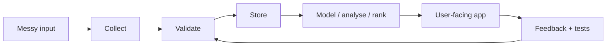

# Matthew Paver

### AI products, data pipelines, automation tools, and analytics apps

I build projects where the hard part is turning messy inputs into something people can actually use: a product, a dashboard, a data pipeline, a recommendation model, or a workflow that runs without constant manual effort.

 

---

## Featured Shelf

<table>
<tr>
<td width="33%" valign="top">
  
  <h3>Inference Brief</h3>
  
Live AI news product. Collects stories, scores them, writes short briefings, and gives readers bookmarks, history, and preferences.

  
<code>Next.js</code> <code>TypeScript</code> <code>Supabase</code> <code>Python</code>

</td>
<td width="33%" valign="top">
  
  <h3>Happening</h3>
  
Private ingestion platform. Turns 103+ London venue websites into structured event data with crawling, dedupe, checks, and tests.

  
<code>Python</code> <code>Playwright</code> <code>SQLite</code> <code>Pydantic</code>

</td>
<td width="33%" valign="top">
  
  <h3>Marketing ML Lakehouse</h3>
  
Runnable data app. Loads raw marketing CSVs into DuckDB, trains XGBoost models, checks quality, and serves a dashboard.

  
<code>Python</code> <code>DuckDB</code> <code>XGBoost</code> <code>Streamlit</code>

</td>
</tr>
</table>

---

## Start Here

<table>
<tr>
<td width="20%" valign="top">
  <h3>Browse</h3>
  
<a href="https://matthewpaver.github.io/MatthewPaver/store/"><strong>Idea Store</strong></a>

  
Visual app-store view of the strongest projects.

</td>
<td width="20%" valign="top">
  <h3>Open</h3>
  
<a href="https://inferencebrief.co/"><strong>Inference Brief</strong></a>

  
Live AI news product you can try now.

</td>
<td width="20%" valign="top">
  <h3>Read</h3>
  
<a href="CASE_STUDIES.md"><strong>Case Studies</strong></a>

  
Short writeups for private systems and product decisions.

</td>
<td width="20%" valign="top">
  <h3>Compare</h3>
  
<a href="Projects.md"><strong>Project Index</strong></a>

  
Full map across public, private, live, and archived work.

</td>
<td width="20%" valign="top">
  <h3>Evidence</h3>
  
<a href="CV_EVIDENCE_LOG.md"><strong>CV Log</strong></a>

  
Anonymised delivery notes and draft CV bullets.

</td>
</tr>
</table>

---

## What I Build

<table>
<tr>
<td width="20%" valign="top">
  <h3>AI Products</h3>
  
Apps where AI sits inside a real user workflow.

  
<code>Inference Brief</code> <code>AI Study Companion</code>

</td>
<td width="20%" valign="top">
  <h3>Data Pipelines</h3>
  
Messy sources turned into clean, repeatable data.

  
<code>Happening</code> <code>Marketing ML Lakehouse</code>

</td>
<td width="20%" valign="top">
  <h3>Automation</h3>
  
Scheduled jobs that can be checked and trusted.

  
<code>Happening</code> <code>Newsletter tools</code>

</td>
<td width="20%" valign="top">
  <h3>Analytics Apps</h3>
  
Analysis packaged into something people can use.

  
<code>ProjectLens</code> <code>HR dashboards</code>

</td>
<td width="20%" valign="top">
  <h3>ML Projects</h3>
  
Ranking, embeddings, forecasting, and generation.

  
<code>Recommender</code> <code>Architexa</code>

</td>
</tr>
</table>

---

## Project Map

| Project | Type | What it does | Stack |
|:---|:---|:---|:---|
| [Inference Brief](https://inferencebrief.co/) | Live product | Collects AI stories, scores them, writes short briefings, publishes issues, and gives readers bookmarks/history/preferences | `Next.js` `TypeScript` `Supabase` `Python` `Stripe` |
| [Happening](CASE_STUDIES.md#happening) | Private system | Turns 103+ London venue websites into clean event data with crawling, extraction, dedupe, daily checks, and 167 tests | `Python` `Playwright` `SQLite` `Pydantic` |
| [Marketing ML Lakehouse](https://github.com/MatthewPaver/marketing-ml-lakehouse) | Public repo | Runnable DuckDB lakehouse with model training, quality checks, and Streamlit reporting | `Python` `DuckDB` `XGBoost` `Streamlit` |
| [AI Study Companion](CASE_STUDIES.md#ai-study-companion) | Private product | Upload notes, generate flashcards/quizzes/study plans, and review with spaced repetition | `FastAPI` `PostgreSQL` `Redis` `Celery` |
| [ProjectLens](https://github.com/MatthewPaver/ProjectLens) | Public repo | Upload project schedule data and spot slippage, milestone pressure, and reporting issues | `Python` `Flask` `pandas` |
| [Dating App Recommendation System](https://github.com/MatthewPaver/dating-app-recommendation-system) | Public repo | Implicit-feedback recommender with 3.4M+ interactions, temporal evaluation, and Top-K metrics | `Python` `NumPy` `SciPy` |
| QuickSupply | Private MVP | Scheduling MVP for schools, teachers, and agency staff with sequential assignment and live status updates | `Next.js` `TypeScript` `PostgreSQL` `SSE` |
| Operations Platform Prototype | Private prototype | Resident requests, service-charge visibility, ticket audit trails, payments, and AI triage | `Next.js` `TypeScript` `Payments` |

More public repos

| Repo | What to look at |
|:---|:---|
| [Architexa](https://github.com/MatthewPaver/Architexa) | Conditional GAN, image-generation API, dataset pipeline |
| [sentence-similarity-analysis](https://github.com/MatthewPaver/sentence-similarity-analysis) | Sentence-transformer embeddings and cosine similarity caveats |
| [pyspark-kafka-streaming](https://github.com/MatthewPaver/pyspark-kafka-streaming) | Compact Kafka and PySpark streaming examples |
| [hr-performance-dashboards](https://github.com/MatthewPaver/hr-performance-dashboards) | Power BI dashboards, prepared CSVs, screenshots, and stakeholder notes |

---

## Operating Model

The goal is simple: make the input clear, make the process repeatable, expose the result through something useful, and make failures visible.

---

## Current Focus

<table>
<tr>
<td width="33%" valign="top">
  <h3>Ship the interface</h3>
  
AI work should have a screen, a user path, or an output someone can actually inspect.

</td>
<td width="33%" valign="top">
  <h3>Make the data repeatable</h3>
  
Pipelines should be rerunnable, checked, and documented enough to survive beyond a one-off notebook.

</td>
<td width="33%" valign="top">
  <h3>Show private work safely</h3>
  
Use anonymised case studies, diagrams, and delivery notes when the real repo or context cannot be public.

</td>
</tr>
</table>

---

## Selected Credentials

  
  
  
  

Certifications are supporting evidence. The project work above is the main proof.

More credentials

| Certification | Issued By |
|:---|:---|
| [RPA Developer Advanced](https://drive.google.com/file/d/15lrcn5_Cn4g-kD165xGNLUGUGXtCptk-/view) | UiPath |
| [BCS Diploma in IT](https://drive.google.com/file/d/15yLBx8nzlhn_PwrGoqQbumRG8zRQPC9t/view) | BCS |
| [BCS Certificate in IT](https://drive.google.com/file/d/160nzem63oIEv3EF9mCU9NGWwwA4NMdMZ/view) | BCS |

---

For the most visual version, open the [Idea Store](https://matthewpaver.github.io/MatthewPaver/store/).

