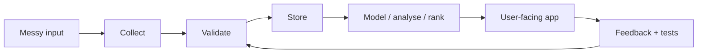

<div align="center">

# Matthew Paver

AI products, data pipelines, automation tools, and analytics apps.

[Idea Store](https://matthewpaver.github.io/MatthewPaver/store/) · [Case Studies](CASE_STUDIES.md) · [Project Index](Projects.md) · [CV](CV.pdf) · [LinkedIn](https://www.linkedin.com/in/matthew-paver-534262166/)

</div>

---

## Quick Read

I like projects where the hard part is turning messy inputs into something people can use.

That usually means one of four things:

- collect and clean awkward data
- wrap AI in a real workflow
- automate work that should not need a person every day
- turn analysis into a product, dashboard, or decision tool

```yaml
live_product: Inference Brief
strongest_private_system: Happening
best_public_data_app: Marketing ML Lakehouse
largest_public_ml_signal: 3.4M+ recommendation interactions
current_theme: make useful systems, not loose demos
```

---

## Open First

| Start here | Why |
|:---|:---|
| [Idea Store](https://matthewpaver.github.io/MatthewPaver/store/) | Fast visual browse of the strongest work |
| [Inference Brief](https://inferencebrief.co/) | Live AI news product you can open now |
| [Case Studies](CASE_STUDIES.md) | Short architecture notes for private systems |
| [Project Index](Projects.md) | Full public/private/archive map |
| [CV Evidence Log](CV_EVIDENCE_LOG.md) | Anonymised delivery evidence I can turn into CV bullets |

---

## Best Work

| Project | What it does | Stack |
|:---|:---|:---|
| [Inference Brief](https://inferencebrief.co/) | Collects AI stories, scores them, writes short briefings, and gives readers bookmarks/history/preferences | `Next.js` `TypeScript` `Supabase` `Python` `Stripe` |
| [Happening](CASE_STUDIES.md#happening) | Turns 103+ London venue websites into clean event data with crawling, extraction, dedupe, and daily checks | `Python` `Playwright` `SQLite` `Pydantic` `GitHub Actions` |
| [AI Study Companion](CASE_STUDIES.md#ai-study-companion) | Upload notes, generate flashcards/quizzes/study plans, and review with spaced repetition | `FastAPI` `PostgreSQL` `Redis` `Celery` `LLMs` |
| [Smart Job Market Intelligence](CASE_STUDIES.md#smart-job-market-intelligence) | Scrapes job listings and turns salary, skill, remote-work, and volume changes into reports and alerts | `Python` `FastAPI` `PostgreSQL` `Redis` `Celery` |
| QuickSupply | Scheduling MVP for schools, teachers, and agency staff with sequential assignment and live status updates | `Next.js` `TypeScript` `PostgreSQL` `SSE` |
| Operations Platform Prototype | Private prototype for resident requests, service-charge visibility, ticket audit trails, payments, and AI triage | `Next.js` `TypeScript` `Payments` `AI triage` |

---

## Public Repos To Inspect

| Repo | What to look at |
|:---|:---|
| [marketing-ml-lakehouse](https://github.com/MatthewPaver/marketing-ml-lakehouse) | Runnable DuckDB lakehouse, XGBoost models, quality checks, Streamlit dashboard |
| [ProjectLens](https://github.com/MatthewPaver/ProjectLens) | Flask upload flow for project schedule risk and reporting outputs |
| [Architexa](https://github.com/MatthewPaver/Architexa) | Conditional GAN, image-generation API, dataset pipeline |
| [dating-app-recommendation-system](https://github.com/MatthewPaver/dating-app-recommendation-system) | Implicit-feedback recommender with temporal evaluation and Top-K metrics |
| [sentence-similarity-analysis](https://github.com/MatthewPaver/sentence-similarity-analysis) | Sentence-transformer embeddings and cosine similarity caveats |
| [pyspark-kafka-streaming](https://github.com/MatthewPaver/pyspark-kafka-streaming) | Compact Kafka and PySpark streaming examples |

---

## How I Build



I try to make the inputs explicit, the pipeline repeatable, the output useful, and the failure modes visible.

---

## Stack

`Python` `TypeScript` `FastAPI` `Next.js` `PostgreSQL` `Redis` `DuckDB` `Supabase` `Firebase` `GCP` `Docker` `GitHub Actions` `Playwright` `n8n`

<details>
<summary>Certifications</summary>

| Certification | Issued By |
|:---|:---|
| [AWS Certified AI Practitioner](https://cp.certmetrics.com/amazon/en/public/verify/credential/455c09a58c6c43beb001b21d3ccec2a0) | Amazon Web Services |
| [AWS Certified Cloud Practitioner](https://cp.certmetrics.com/amazon/en/public/verify/credential/d0dd54bf93df495da5c3e75ee69940fe) | Amazon Web Services |
| [Neo4j Certified Professional](https://drive.google.com/file/d/15oXe_G86TEiETdC8kGBhbnKoMjVZ5mQQ/view) | Neo4j |
| [AI Agents Course](https://drive.google.com/file/d/1NgSeIIF49Sqh2DAMY5KQEtnaddSc1Sqw/view) | Hugging Face |
| [RPA Developer Advanced](https://drive.google.com/file/d/15lrcn5_Cn4g-kD165xGNLUGUGXtCptk-/view) | UiPath |
| [BCS Diploma in IT](https://drive.google.com/file/d/15yLBx8nzlhn_PwrGoqQbumRG8zRQPC9t/view) | BCS |
| [BCS Certificate in IT](https://drive.google.com/file/d/160nzem63oIEv3EF9mCU9NGWwwA4NMdMZ/view) | BCS |

</details>

---

## Notes

Some of the strongest work is private because it uses professional or product-sensitive context. I keep those examples public-safe through short case studies, diagrams, screenshots, and anonymised delivery notes.

For the most visual version, use the [Idea Store](https://matthewpaver.github.io/MatthewPaver/store/).
