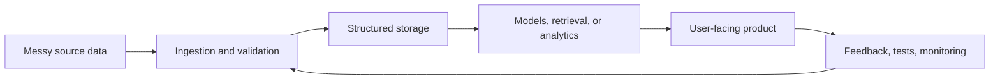

# Matthew Paver

### AI and data engineer building reliable systems from messy inputs

I build production-minded AI, automation, and analytics systems: retrieval pipelines, event ingestion, full-stack AI products, recommendation engines, and data products that can be tested, operated, and improved.

---

## What I Build

| Area | What I care about | Evidence |
|:---|:---|:---|
| AI products | Useful workflows around models, not just prompts | Inference Brief, AI Study Companion |
| Data engineering | Messy inputs into structured, queryable, repeatable outputs | Happening, Marketing ML Lakehouse |
| Automation | Jobs that can run every day with tests and observability | Happening, newsletter pipelines |
| Analytics | Decision-useful dashboards and reporting systems | ProjectLens, HR analytics, Netflix EDA |
| ML systems | Practical ranking, retrieval, forecasting, and generation | recommendation system, Architexa, sentence similarity |

---

## Flagship Systems

<table>
<tr>
<td valign="top" width="50%">

### Happening 

Deterministic event ingestion and normalisation system covering **103 London venues**. Built around multi-strategy crawling, structured extraction, deduplication, SQLite storage, and daily automation with a **167-test** suite behind it.

**Signal:** web automation, data quality, source configuration, scheduled runs, reliability engineering.

`Python` `Playwright` `SQLite` `Pydantic` `GitHub Actions`

</td>
<td valign="top" width="50%">

### Inference Brief

AI briefing product with a personalised reading experience, bookmarks, reading history, topic preferences, subscription flows, and an editorial pipeline that collects, filters, scores, summarises, and publishes issues.

**Signal:** product thinking, full-stack delivery, AI-assisted publishing workflow.

`Next.js` `TypeScript` `Supabase` `Python` `Stripe`

</td>
</tr>
<tr>
<td valign="top" width="50%">

### AI Study Companion 

Full-stack study platform for turning PDFs and notes into flashcards, quizzes, and adaptive study plans. Includes parsing, token-aware chunking, spaced repetition, async generation jobs, usage tiers, and local or hosted LLM support.

**Signal:** document AI, background jobs, auth/billing boundaries, learning loops.

`Python` `FastAPI` `PostgreSQL` `Redis` `Celery`

</td>
<td valign="top" width="50%">

### Smart Job Market Intelligence 

Job market analytics platform for salary intelligence, skill trends, posting volume analysis, remote ratio tracking, and alerts. Built around scraping, background processing, and product-style API tiers.

**Signal:** data ingestion, trend analysis, API design, recurring jobs.

`Python` `FastAPI` `PostgreSQL` `Redis` `Celery`

</td>
</tr>
</table>

---

## Public Proof

| Project | Why it matters | Stack |
|:---|:---|:---|
| [Marketing ML Lakehouse](https://github.com/MatthewPaver/marketing-ml-lakehouse) | Local-first analytics lakehouse with medallion layers, ML models, and Streamlit reporting | `Python` `DuckDB` `XGBoost` `Streamlit` |
| [ProjectLens](https://github.com/MatthewPaver/ProjectLens) | Project schedule risk analysis with a Flask app, processing pipeline, and reporting outputs | `Python` `Flask` `pandas` |
| [Architexa](https://github.com/MatthewPaver/Architexa) | Conditional GAN project for architecture-themed image generation with API and training assets | `TensorFlow` `Keras` `Flask` |
| [Dating App Recommendation System](https://github.com/MatthewPaver/dating-app-recommendation-system) | Implicit-feedback recommendation engine with notebook walkthrough and lightweight CLI | `Python` `NumPy` `SciPy` |

More: [Project Index](Projects.md) for the fuller curated portfolio.

For a more browsable version, open the [Idea Store](https://matthewpaver.github.io/MatthewPaver/store/).

---

## How I Think About Systems

The pattern I keep coming back to is simple: make the inputs explicit, make the pipeline repeatable, expose the result through a useful workflow, and close the loop with tests or feedback.

---

## Current Focus

- Retrieval and automation systems that need to run cleanly and predictably.
- AI products with real user-facing workflows, not just model demos.
- Data and analytics tooling that turns messy inputs into something decision-useful.

## What I'm Building in Professional Settings (Anonymised)

- Internal AI assistants and workflow automations, taken from discovery through production readiness.
- Delivery governance design: intake, risk classification, security and privacy gates, and clear go-live criteria.
- Production hardening for lightweight apps: authentication, access boundaries, service-account hygiene, auditability, and handover readiness.
- Documentation operations: linked playbooks, decision logs, and portfolio views maintained through recurring review loops.

## Operational Tech Stack

`Python` `TypeScript` `n8n` `FastAPI` `Firebase` `GCP` `PostgreSQL` `Redis` `GitHub Actions` `Docker` `Obsidian`

_All professional examples are intentionally anonymised and focused on engineering patterns rather than internal identifiers._

---

---

## Certifications

| Certification | Issued By |
|:---|:---|
| [AWS Certified AI Practitioner](https://cp.certmetrics.com/amazon/en/public/verify/credential/455c09a58c6c43beb001b21d3ccec2a0) | Amazon Web Services |
| [AWS Certified Cloud Practitioner](https://cp.certmetrics.com/amazon/en/public/verify/credential/d0dd54bf93df495da5c3e75ee69940fe) | Amazon Web Services |
| [Neo4j Certified Professional](https://drive.google.com/file/d/15oXe_G86TEiETdC8kGBhbnKoMjVZ5mQQ/view) | Neo4j |
| [AI Agents Course](https://drive.google.com/file/d/1NgSeIIF49Sqh2DAMY5KQEtnaddSc1Sqw/view) | Hugging Face |
| [RPA Developer Advanced](https://drive.google.com/file/d/15lrcn5_Cn4g-kD165xGNLUGUGXtCptk-/view) | UiPath |
| [BCS Diploma in IT](https://drive.google.com/file/d/15yLBx8nzlhn_PwrGoqQbumRG8zRQPC9t/view) | BCS |
| [BCS Certificate in IT](https://drive.google.com/file/d/160nzem63oIEv3EF9mCU9NGWwwA4NMdMZ/view) | BCS |

---

Open to collaboration, interesting product work, and AI/data engineering opportunities.

