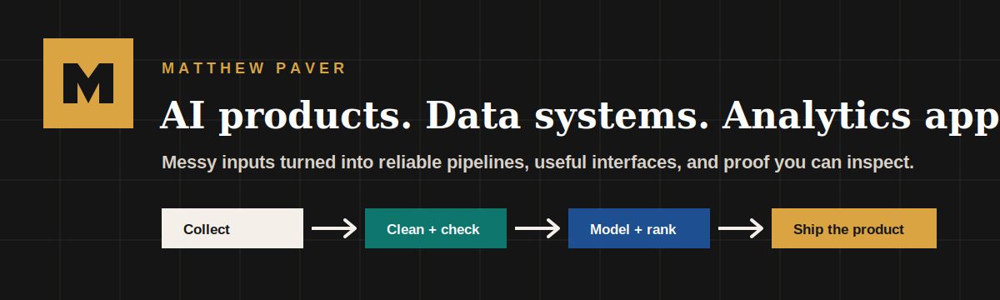
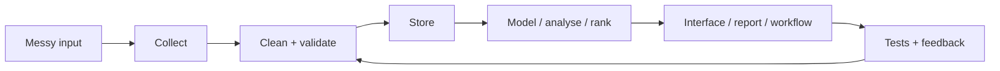

# Matthew Paver

### AI products, data systems, and analytics apps

I build practical systems from messy inputs: crawled websites, scraped listings, raw CSVs, notes, schedules, dashboards, and recommendation data. The pattern is simple: collect the data, clean it, check it, and ship something someone can open.

  <a href="https://matthewpaver.github.io/MatthewPaver/store/"><strong>Portfolio Store</strong></a> ·
  <a href="https://inferencebrief.co/"><strong>Live Product</strong></a> ·
  <a href="CASE_STUDIES.md"><strong>Case Studies</strong></a> ·
  <a href="Projects.md"><strong>Project Index</strong></a> ·
  <a href="CV.pdf"><strong>CV</strong></a> ·
  <a href="https://www.linkedin.com/in/matthew-paver-534262166/"><strong>LinkedIn</strong></a>

  
  
  
  
  
  
  

<table>
<tr>
<td align="center"><strong>Live product</strong> Inference Brief</td>
<td align="center"><strong>103+ sources</strong> Happening ingestion</td>
<td align="center"><strong>3.4M+ interactions</strong> Recommendation dataset</td>
<td align="center"><strong>167 tests</strong> Private crawler suite</td>
</tr>
</table>

---

## Open First

<table>
<tr>
<td width="33%" valign="top">
  
  <h3>Inference Brief</h3>
  
<strong>Problem:</strong> keeping up with AI news without reading a pile of noisy feeds.

  
<strong>Build:</strong> live reader product with story collection, scoring, summaries, publishing, accounts, bookmarks, and history.

  
<code>Next.js</code> <code>TypeScript</code> <code>Supabase</code> <code>Python</code>

  
<a href="https://inferencebrief.co/">Open product</a>

</td>
<td width="33%" valign="top">
  
  <h3>Happening</h3>
  
<strong>Problem:</strong> venue event data is scattered across inconsistent public websites.

  
<strong>Build:</strong> private ingestion system with 103+ source configs, crawling, extraction, dedupe, checks, and tests.

  
<code>Python</code> <code>Playwright</code> <code>SQLite</code> <code>Pydantic</code>

  
<a href="CASE_STUDIES.md#happening">Read case study</a>

</td>
<td width="33%" valign="top">
  
  <h3>Marketing ML Lakehouse</h3>
  
<strong>Problem:</strong> analytics projects often stop at notebooks instead of a repeatable data product.

  
<strong>Build:</strong> public DuckDB lakehouse with quality checks, XGBoost training, and Streamlit reporting.

  
<code>Python</code> <code>DuckDB</code> <code>XGBoost</code> <code>Streamlit</code>

  
<a href="https://github.com/MatthewPaver/marketing-ml-lakehouse">Inspect repo</a>

</td>
</tr>
</table>

Open the [Portfolio Store](https://matthewpaver.github.io/MatthewPaver/store/) for the full app-store view across live products, private systems, public repos, credentials, and archived experiments.

---

## Credentials

<table>
<tr>
<td width="25%" valign="top">
  
   
  AI and cloud fundamentals
</td>
<td width="25%" valign="top">
  
   
  Cloud architecture foundations
</td>
<td width="25%" valign="top">
  
   
  Graph data modelling
</td>
<td width="25%" valign="top">
  
   
  Agent workflows and evaluation
</td>
</tr>
<tr>
<td width="25%" valign="top">
  
   
  Automation and RPA delivery
</td>
<td width="25%" valign="top">
  
   
  Professional IT foundations
</td>
<td width="25%" valign="top">
  
   
  Core systems and practice
</td>
<td width="25%" valign="top">
  
   
  Full background and experience
</td>
</tr>
</table>

---

## Project Map

| Project | Solves | What to inspect |
|:---|:---|:---|
| [Inference Brief](https://inferencebrief.co/) | AI-news overload | Live product, issue archive, accounts, bookmarks, history, preferences |
| [Happening](CASE_STUDIES.md#happening) | Fragmented event listings | 103+ source configs, ingestion workflow, dedupe, validation, scheduled checks |
| [Marketing ML Lakehouse](https://github.com/MatthewPaver/marketing-ml-lakehouse) | Notebook-to-product analytics | DuckDB medallion flow, quality checks, XGBoost training, Streamlit app |
| [AI Study Companion](CASE_STUDIES.md#ai-study-companion) | Turning notes into revision | Upload flow, generated flashcards/quizzes/study plans, spaced repetition |
| [ProjectLens](https://github.com/MatthewPaver/ProjectLens) | Project schedule risk | Upload-to-analysis flow, slippage reporting, milestone pressure, Power BI outputs |
| [Dating App Recommendation System](https://github.com/MatthewPaver/dating-app-recommendation-system) | Ranking candidates from interaction data | 3.4M+ interactions, temporal evaluation, Top-K metrics |

More repos

| Repo | Solves | What to inspect |
|:---|:---|
| [Architexa](https://github.com/MatthewPaver/Architexa) | Architecture image generation | Conditional GAN, dataset pipeline, Flask API |
| [sentence-similarity-analysis](https://github.com/MatthewPaver/sentence-similarity-analysis) | Explaining semantic search | Sentence-transformer embeddings, cosine ranking, retrieval caveats |
| [pyspark-kafka-streaming](https://github.com/MatthewPaver/pyspark-kafka-streaming) | Streaming data examples | Kafka and PySpark pipeline basics |
| [hr-performance-dashboards](https://github.com/MatthewPaver/hr-performance-dashboards) | Stakeholder reporting | Power BI dashboards, prepared CSVs, screenshots, commentary |

---

## Build Pattern

The strongest work is the whole loop: not just the model, not just the dashboard, not just the script. The data path should be repeatable, the output should be easy to inspect, and failures should be visible.
