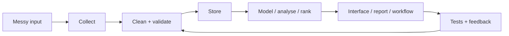

# Matthew Paver

### AI products, data systems, automation, and analytics apps

I build practical systems around messy inputs: crawled websites, scraped listings, raw CSVs, notes, schedules, dashboards, and recommendation data. The pattern is usually the same: collect it, clean it, test it, package it, and make it useful through a product or workflow someone can actually open.

 

---

## Snapshot

<table>
<tr>
<td width="25%" valign="top">
  <h3>Live product</h3>
  
<a href="https://inferencebrief.co/"><strong>Inference Brief</strong></a>

  
AI news product with publishing, accounts, bookmarks, history, preferences, and a working reader experience.

</td>
<td width="25%" valign="top">
  <h3>Strongest private system</h3>
  
<a href="CASE_STUDIES.md#happening"><strong>Happening</strong></a>

  
103+ London venue sources turned into structured event data with crawling, dedupe, checks, and tests.

</td>
<td width="25%" valign="top">
  <h3>Best public data app</h3>
  
<a href="https://github.com/MatthewPaver/marketing-ml-lakehouse"><strong>Marketing ML Lakehouse</strong></a>

  
DuckDB lakehouse, data quality checks, XGBoost training, and a Streamlit dashboard.

</td>
<td width="25%" valign="top">
  <h3>Largest public ML dataset</h3>
  
<a href="https://github.com/MatthewPaver/dating-app-recommendation-system"><strong>3.4M+ interactions</strong></a>

  
Recommendation-system project with temporal evaluation and Top-K metrics.

</td>
</tr>
</table>

---

## Featured Shelf

<table>
<tr>
<td width="33%" valign="top">
  
  <h3>Inference Brief</h3>
  
Live AI news reader. Collects stories, scores them, writes short briefings, publishes issues, and gives readers bookmarks, history, and preferences.

  
<code>Next.js</code> <code>TypeScript</code> <code>Supabase</code> <code>Python</code> <code>Stripe</code>

</td>
<td width="33%" valign="top">
  
  <h3>Happening</h3>
  
Private ingestion platform. Turns venue websites into clean London event data with adapters, extraction rules, dedupe, scheduled checks, and operational tests.

  
<code>Python</code> <code>Playwright</code> <code>SQLite</code> <code>Pydantic</code>

</td>
<td width="33%" valign="top">
  
  <h3>Marketing ML Lakehouse</h3>
  
Runnable public data app. Loads raw marketing CSVs into DuckDB, builds quality-checked tables, trains models, and serves a dashboard.

  
<code>Python</code> <code>DuckDB</code> <code>XGBoost</code> <code>Streamlit</code>

</td>
</tr>
</table>

---

## What I Build

| Mode | What that means | Examples |
|:---|:---|:---|
| **AI products** | AI is part of a real workflow, not just a prompt demo | [Inference Brief](https://inferencebrief.co/), [AI Study Companion](CASE_STUDIES.md#ai-study-companion) |
| **Data pipelines** | Messy sources become clean, repeatable datasets | [Happening](CASE_STUDIES.md#happening), [Marketing ML Lakehouse](https://github.com/MatthewPaver/marketing-ml-lakehouse) |
| **Automation** | Jobs run on a schedule and leave evidence behind | Happening checks, newsletter tools, scrape monitors |
| **Analytics apps** | Analysis is packaged into an interface people can use | [ProjectLens](https://github.com/MatthewPaver/ProjectLens), HR dashboards |
| **ML projects** | Ranking, embeddings, forecasting, and generation | recommender systems, Architexa, sentence similarity |

---

## Project Map

| Project | Type | What it does | Stack |
|:---|:---|:---|:---|
| [Inference Brief](https://inferencebrief.co/) | Live product | Collects AI stories, scores them, writes briefings, publishes issues, and gives readers bookmarks/history/preferences | `Next.js` `TypeScript` `Supabase` `Python` `Stripe` |
| [Happening](CASE_STUDIES.md#happening) | Private system | Turns 103+ London venue websites into clean event data with crawling, extraction, dedupe, checks, and tests | `Python` `Playwright` `SQLite` `Pydantic` |
| [Marketing ML Lakehouse](https://github.com/MatthewPaver/marketing-ml-lakehouse) | Public repo | Runnable DuckDB lakehouse with model training, quality checks, and Streamlit reporting | `Python` `DuckDB` `XGBoost` `Streamlit` |
| [AI Study Companion](CASE_STUDIES.md#ai-study-companion) | Private product | Upload notes, generate flashcards/quizzes/study plans, and review with spaced repetition | `FastAPI` `PostgreSQL` `Redis` `Celery` |
| [ProjectLens](https://github.com/MatthewPaver/ProjectLens) | Public repo | Upload project schedule data and spot slippage, milestone pressure, and reporting issues | `Python` `Flask` `pandas` |
| [Dating App Recommendation System](https://github.com/MatthewPaver/dating-app-recommendation-system) | Public repo | Implicit-feedback recommender with 3.4M+ interactions, temporal evaluation, and Top-K metrics | `Python` `NumPy` `SciPy` |
| QuickSupply | Private MVP | Scheduling MVP for schools, teachers, and agency staff with sequential assignment and live status updates | `Next.js` `TypeScript` `PostgreSQL` `SSE` |
| Operations Platform Prototype | Private prototype | Resident requests, service-charge visibility, ticket audit trails, payments, and AI triage | `Next.js` `TypeScript` `Payments` |

More public repos

| Repo | What to look at |
|:---|:---|
| [Architexa](https://github.com/MatthewPaver/Architexa) | Conditional GAN, image-generation API, dataset pipeline |
| [sentence-similarity-analysis](https://github.com/MatthewPaver/sentence-similarity-analysis) | Sentence-transformer embeddings and cosine similarity caveats |
| [pyspark-kafka-streaming](https://github.com/MatthewPaver/pyspark-kafka-streaming) | Compact Kafka and PySpark streaming examples |
| [hr-performance-dashboards](https://github.com/MatthewPaver/hr-performance-dashboards) | Power BI dashboards, prepared CSVs, screenshots, and stakeholder notes |

---

## How I Think About Projects

The part I care about is the whole loop: not just the model, not just the dashboard, not just the script. The work is strongest when the data path is repeatable, the output is easy to inspect, and failures are visible.

---

## Current Focus

<table>
<tr>
<td width="33%" valign="top">
  <h3>Productising AI work</h3>
  
Turning AI workflows into usable apps with accounts, state, background jobs, and a clear user path.

</td>
<td width="33%" valign="top">
  <h3>Reliable data systems</h3>
  
Building pipelines with checks, fixtures, test coverage, and enough observability to trust scheduled runs.

</td>
<td width="33%" valign="top">
  <h3>Showing private work safely</h3>
  
Using anonymised case studies, diagrams, and screenshots when the strongest systems cannot be public.

</td>
</tr>
</table>

---

## Credentials

<table>
<tr>
<td width="20%" align="center">
  
</td>
<td width="20%" align="center">
  
</td>
<td width="20%" align="center">
  
</td>
<td width="20%" align="center">
  
</td>
<td width="20%" align="center">
  
</td>
</tr>
</table>

More credentials

| Certification | Issued By |
|:---|:---|
| [Hugging Face AI Agents Course](https://drive.google.com/file/d/1NgSeIIF49Sqh2DAMY5KQEtnaddSc1Sqw/view) | Hugging Face |
| [BCS Certificate in IT](https://drive.google.com/file/d/160nzem63oIEv3EF9mCU9NGWwwA4NMdMZ/view) | BCS |

---

The visual version is the [Idea Store](https://matthewpaver.github.io/MatthewPaver/store/): a browsable shelf of live products, private systems, public repos, and earlier prototypes.

