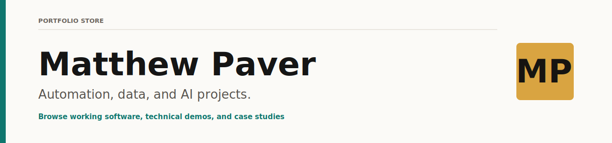
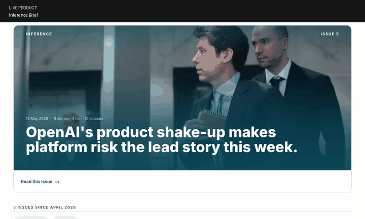
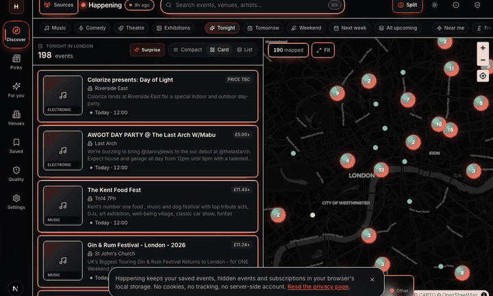
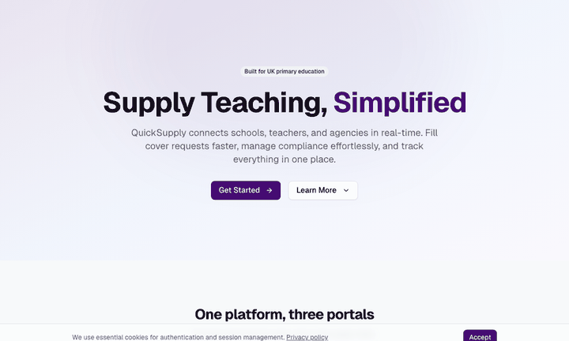
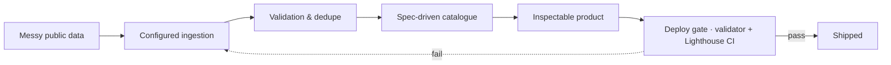

  

  
  
  

  
  
  
  
  
  

---

## Featured products

<table>
<tr>
<td width="33%" valign="top">
  
  <h3>Inference Brief · <a href="https://inferencebrief.co/">live</a></h3>
  
An AI-news reader with paid subscriptions. Source collection, scoring, summaries, issues, bookmarks, and reading history.

  
<code>Next.js</code> <code>TypeScript</code> <code>Supabase</code> <code>Python</code> <code>Stripe</code>

  
<a href="https://matthewpaver.github.io/MatthewPaver/store/preview.html?app=inference">Preview ↗</a> · <a href="https://inferencebrief.co/">Open product ↗</a> · <a href="CASE_STUDIES.md#inference-brief">Case study ↗</a>

</td>
<td width="33%" valign="top">
  
  <h3>Happening · private</h3>
  
Turns 103 inconsistent venue pages into structured event data. 167-test reliability suite, scheduled daily runs.

  
<code>Python</code> <code>Playwright</code> <code>SQLite</code> <code>Pydantic</code> <code>GitHub Actions</code>

  
<a href="https://matthewpaver.github.io/MatthewPaver/store/preview.html?app=happening">Preview ↗</a> · <a href="CASE_STUDIES.md#featured-build-happening">Case study ↗</a>

</td>
<td width="33%" valign="top">
  
  <h3>QuickSupply · private MVP</h3>
  
A school cover-ops workflow built for three sides: school, agency, teacher. Sequential assignment, compliance checks, live status.

  
<code>Next.js</code> <code>TypeScript</code> <code>PostgreSQL</code> <code>Drizzle</code> <code>SSE</code>

  
<a href="https://matthewpaver.github.io/MatthewPaver/store/preview.html?app=quicksupply">Preview ↗</a>

</td>
</tr>
</table>

## At a glance

| | |
|:---|:---|
| **Role**     | Software engineer · AI, data, analytics |
| **Based**    | London |
| **Shipping** | [Inference Brief](https://inferencebrief.co/) (live, paid) · Happening (private venue-ingestion system) |
| **Open to**  | Product, data, and automation roles |
| **Stack**    | Python · TypeScript · FastAPI · Next.js · Postgres / DuckDB · Playwright · GitHub Actions |
| **Specs**    | [Constitution](.specify/memory/constitution.md) · [Feature spec](specs/001-portfolio-store-reliability/spec.md) · [Validator](scripts/validate-store.mjs) · [Lighthouse CI](.lighthouserc.json) |

## How the work flows

Every project I publish has this shape: a configured input, an explicit check, an artifact that can be opened, and a deploy gate that refuses drift. The [portfolio store](https://matthewpaver.github.io/MatthewPaver/store/) runs on that loop — Spec Kit constitution, validator, Lighthouse CI gates, no framework, no build system.

## Open these next

<table>
<tr>
<td valign="top" width="50%">

**▸ Runnable applications**

- [Marketing ML Lakehouse](https://github.com/MatthewPaver/marketing-ml-lakehouse) — Bronze/silver/gold DuckDB flow, XGBoost training, data-quality checks, Streamlit dashboard  
- [ProjectLens](https://github.com/MatthewPaver/ProjectLens) — Schedule-risk Flask app: upload, slippage analysis, milestone pressure, Power BI-ready exports  
- [AI Workflow Evaluator](https://github.com/MatthewPaver/ai-workflow-evaluator) — Runnable quality gate for LLM outputs: accuracy, grounding, hallucination risk, latency, cost, review · [demo](https://matthewpaver.github.io/ai-workflow-evaluator/app/)  

**▸ Analytics handoff**

- [HR Performance Analytics](https://github.com/MatthewPaver/hr-performance-dashboards) — Power BI dashboard package: PBIX files, dashboard previews, methodology PDF, stakeholder commentary  

</td>
<td valign="top" width="50%">

**▸ Notebook demos and technical examples**

- [Dating App Recommendation System](https://github.com/MatthewPaver/dating-app-recommendation-system) — Implicit-feedback ranking with temporal holdouts and Top-K metrics  
- [Sentence Similarity Analysis](https://github.com/MatthewPaver/sentence-similarity-analysis) — Embedding retrieval with a deliberate point about similarity not being truth  
- [PySpark Kafka Streaming](https://github.com/MatthewPaver/pyspark-kafka-streaming) — DataFrames, Structured Streaming, JSON event production  

</td>
</tr>
</table>

## Latest shipping

| When | What |
|:---|:---|
| **2026-05** | AI Workflow Evaluator — local quality gate for LLM outputs with dashboard, tests, and CI |
| **2026-05** | Spec-driven portfolio governance: constitution, validator, Lighthouse CI, JSON-LD, manifest, CSP, custom OG card |
| **2026-04** | Inference Brief — accounts, paid subscriptions, bookmarks, reading history |
| **2026-03** | Happening — 167-test reliability suite, 103 venue source configs |
| **2026-02** | QuickSupply MVP — three-sided workflow, sequential assignment, live SSE status |

## GitHub signals

  
  

## Credentials

  
  
  
  
  
  
  

## Routes through the work

| If you want | Open |
|:---|:---|
| The best visual overview | [Portfolio Store](https://matthewpaver.github.io/MatthewPaver/store/) |
| A live paid product | [Inference Brief](https://inferencebrief.co/) |
| Architecture and tradeoff stories | [Case Studies](CASE_STUDIES.md) |
| A piece of writing with an opinion | [What a 167-test scraping suite actually catches](writing/what-a-scraping-suite-catches.md) |
| The full repo map | [Projects appendix](Projects.md) |
| Background and experience | [CV](CV.pdf) |

<strong>Latest public activity</strong> (auto-updated daily)

<!-- AUTO:ACTIVITY_START -->
## Latest Public Activity (Auto-Updated)

_This section is automatically refreshed by GitHub Actions._

- Last refresh (UTC): 2026-05-21 10:50

| Repo | Last push | What it is |
|:---|:---:|:---|
| [MatthewPaver](https://github.com/MatthewPaver/MatthewPaver) | 2026-05-20 | Portfolio: AI products, data systems, ML, and analytics — every project has a preview,… |
| [hr-performance-dashboards](https://github.com/MatthewPaver/hr-performance-dashboards) | 2026-05-17 | Power BI dashboard handoff package for HR, absence, and sales performance analytics. |
| [marketing-ml-lakehouse](https://github.com/MatthewPaver/marketing-ml-lakehouse) | 2026-05-17 | Local DuckDB, XGBoost, and Streamlit analytics pipeline for marketing performance data. |
| [netflix-content-analysis](https://github.com/MatthewPaver/netflix-content-analysis) | 2026-05-17 | Notebook EDA of Netflix title data with country, genre, timeline, and catalog growth an… |
| [sentence-similarity-analysis](https://github.com/MatthewPaver/sentence-similarity-analysis) | 2026-05-16 | Sentence-transformer notebook showing embedding similarity, cosine ranking, and retriev… |
| [dating-app-recommendation-system](https://github.com/MatthewPaver/dating-app-recommendation-system) | 2026-05-16 | Swipe-style recommendation system with implicit feedback, temporal holdouts, and Top-K… |

<!-- AUTO:ACTIVITY_END -->

  Hand-built. Spec-driven. Deploy gated. — <a href="https://github.com/MatthewPaver/MatthewPaver">github.com/MatthewPaver</a>

