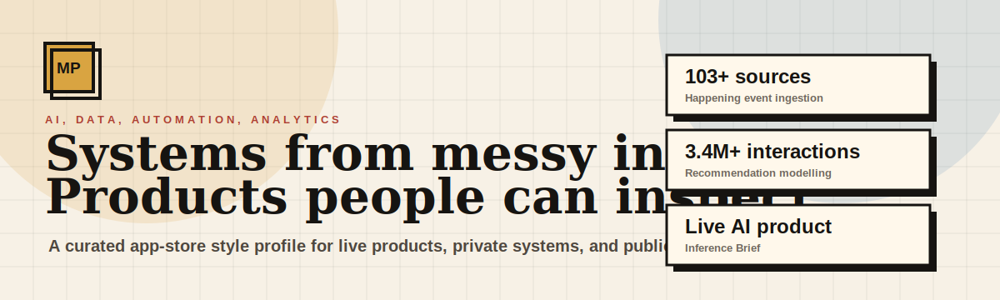
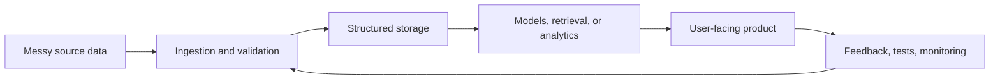

  

# Matthew Paver

### AI and data engineer building reliable systems from messy inputs

I build production-minded AI, automation, and analytics systems: retrieval pipelines, event ingestion, full-stack AI products, recommendation engines, and data products that can be tested, operated, and improved.

---

## Start Here

| If you have... | Open this | What it proves |
|:---|:---|:---|
| 30 seconds | [Idea Store](https://matthewpaver.github.io/MatthewPaver/store/) | The curated app-store view of the strongest work |
| 2 minutes | [Case Studies](CASE_STUDIES.md) | Architecture, tradeoffs, reliability, and product thinking |
| 5 minutes | [Project Index](Projects.md) | The full map across public, private, live, and archived work |
| Want a live example | [Inference Brief](https://inferencebrief.co/) | A shipped AI briefing product with a real reading workflow |
| Want CV evidence | [CV Evidence Log](CV_EVIDENCE_LOG.md) | Anonymised delivery evidence and CV-ready bullet bank |

---

## Portfolio Signal

| Signal | Evidence | Why it matters |
|:---|:---|:---|
| **Live AI product** | Inference Brief | Product surface, account flows, editorial automation, and publishing loop |
| **103+ messy sources** | Happening | Config-driven ingestion, extraction, deduplication, tests, and scheduled automation |
| **3.4M+ interactions** | Dating App Recommendation System | Practical recommendation modelling with temporal evaluation |
| **Runnable data app** | Marketing ML Lakehouse | DuckDB medallion layers, XGBoost, Streamlit, and local-first analytics |
| **Private product depth** | AI Study Companion, Job Intelligence, QuickSupply | Auth, async jobs, tiers, alerts, operations workflows, and deployment thinking |

---

## What I Build

| Area | What I care about | Evidence |
|:---|:---|:---|
| AI products | Useful workflows around models, not just prompts | Inference Brief, AI Study Companion |
| Data engineering | Messy inputs into structured, queryable, repeatable outputs | Happening, Marketing ML Lakehouse |
| Automation | Jobs that can run every day with tests and observability | Happening, newsletter pipelines |
| Analytics | Decision-useful dashboards and reporting systems | ProjectLens, HR analytics, Netflix EDA |
| ML systems | Practical ranking, retrieval, forecasting, and generation | Recommendation system, Architexa, sentence similarity |

---

## Featured Systems

| System | Status | Signal | Stack |
|:---|:---|:---|:---|
| [Inference Brief](https://inferencebrief.co/) | Live product | Personalised AI briefing product with collection, filtering, scoring, summarisation, publishing, bookmarks, history, preferences, and subscription flows | `Next.js` `TypeScript` `Supabase` `Python` `Stripe` |
| [Happening](CASE_STUDIES.md#happening) | Private system | Deterministic event ingestion across **103+ London venue sources** with Playwright crawling, structured extraction, deduplication, SQLite storage, daily automation, and **167 tests** | `Python` `Playwright` `SQLite` `Pydantic` `GitHub Actions` |
| [AI Study Companion](CASE_STUDIES.md#ai-study-companion) | Private product | Documents into flashcards, quizzes, adaptive study plans, token-aware chunking, async generation jobs, review loops, tiers, and export paths | `Python` `FastAPI` `PostgreSQL` `Redis` `Celery` |
| [Smart Job Market Intelligence](CASE_STUDIES.md#smart-job-market-intelligence) | Private system | Job scraping, salary trends, skill trends, posting volume, remote ratios, alerts, and product-style API tiers | `Python` `FastAPI` `PostgreSQL` `Redis` `Celery` |

---

## Public Repositories

| Project | What to inspect | Stack |
|:---|:---|:---|
| [Marketing ML Lakehouse](https://github.com/MatthewPaver/marketing-ml-lakehouse) | Local-first analytics lakehouse with medallion layers, model training, quality checks, and Streamlit reporting | `Python` `DuckDB` `XGBoost` `Streamlit` |
| [ProjectLens](https://github.com/MatthewPaver/ProjectLens) | Project schedule risk analysis with a Flask app, processing pipeline, and reporting outputs | `Python` `Flask` `pandas` |
| [Architexa](https://github.com/MatthewPaver/Architexa) | Conditional GAN project for architecture-themed image generation with API and training assets | `TensorFlow` `Keras` `Flask` |
| [Dating App Recommendation System](https://github.com/MatthewPaver/dating-app-recommendation-system) | Implicit-feedback recommendation engine with notebook walkthrough and lightweight CLI | `Python` `NumPy` `SciPy` |
| [Sentence Similarity Analysis](https://github.com/MatthewPaver/sentence-similarity-analysis) | Compact NLP retrieval demo using transformer embeddings and cosine similarity | `Python` `sentence-transformers` |

More work: [Project Index](Projects.md), [Case Studies](CASE_STUDIES.md), and the [Idea Store](https://matthewpaver.github.io/MatthewPaver/store/).

---

## System Pattern

The pattern I keep coming back to: make the inputs explicit, make the pipeline repeatable, expose the result through a useful workflow, and close the loop with tests or feedback.

---

## Current Focus

- Retrieval and automation systems that need to run cleanly and predictably.
- AI products with real user-facing workflows, not just model demos.
- Data and analytics tooling that turns messy inputs into something decision-useful.
- Portfolio packaging that makes private-system engineering visible without exposing sensitive details.

---

## Professional Work, Anonymised

- Internal AI assistants and workflow automations, taken from discovery through production readiness.
- Delivery governance design: intake, risk classification, security and privacy gates, and clear go-live criteria.
- Production hardening for lightweight apps: authentication, access boundaries, service-account hygiene, auditability, and handover readiness.
- Documentation operations: linked playbooks, decision logs, and portfolio views maintained through recurring review loops.

All professional examples are intentionally anonymised and focused on engineering patterns rather than internal identifiers.

---

## Operating Stack

`Python` `TypeScript` `FastAPI` `n8n` `PostgreSQL` `Redis` `DuckDB` `Firebase` `GCP` `GitHub Actions` `Docker` `Supabase` `Next.js` `Playwright`

  
  
  
  
  
  
  
  
  
  

---

## Certifications

| Certification | Issued By |
|:---|:---|
| [AWS Certified AI Practitioner](https://cp.certmetrics.com/amazon/en/public/verify/credential/455c09a58c6c43beb001b21d3ccec2a0) | Amazon Web Services |
| [AWS Certified Cloud Practitioner](https://cp.certmetrics.com/amazon/en/public/verify/credential/d0dd54bf93df495da5c3e75ee69940fe) | Amazon Web Services |
| [Neo4j Certified Professional](https://drive.google.com/file/d/15oXe_G86TEiETdC8kGBhbnKoMjVZ5mQQ/view) | Neo4j |
| [AI Agents Course](https://drive.google.com/file/d/1NgSeIIF49Sqh2DAMY5KQEtnaddSc1Sqw/view) | Hugging Face |
| [RPA Developer Advanced](https://drive.google.com/file/d/15lrcn5_Cn4g-kD165xGNLUGUGXtCptk-/view) | UiPath |
| [BCS Diploma in IT](https://drive.google.com/file/d/15yLBx8nzlhn_PwrGoqQbumRG8zRQPC9t/view) | BCS |
| [BCS Certificate in IT](https://drive.google.com/file/d/160nzem63oIEv3EF9mCU9NGWwwA4NMdMZ/view) | BCS |

---

Open to collaboration, interesting product work, and AI/data engineering opportunities.

