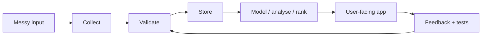

<div align="center">

# Matthew Paver

### AI products, data pipelines, automation tools, and analytics apps

I build projects where the hard part is turning messy inputs into something people can actually use: a product, a dashboard, a data pipeline, a recommendation model, or a workflow that runs without constant manual effort.

<a href="https://matthewpaver.github.io/MatthewPaver/store/">
  
</a>
<a href="CASE_STUDIES.md">
  
</a>
<a href="Projects.md">
  
</a>
<a href="SHOWCASE_ROADMAP.md">
  
</a>
<a href="https://inferencebrief.co/">
  
</a>
<a href="CV.pdf">
  
</a>
<a href="CV_EVIDENCE_LOG.md">
  
</a>
<a href="https://www.linkedin.com/in/matthew-paver-534262166/">
  
</a>

</div>

---

## Start Here

| If you have... | Open this | Why |
|:---|:---|:---|
| 30 seconds | [Idea Store](https://matthewpaver.github.io/MatthewPaver/store/) | Visual app-store view of the strongest work |
| 2 minutes | [Inference Brief](https://inferencebrief.co/) | Live AI news product you can open now |
| 5 minutes | [Case Studies](CASE_STUDIES.md) | How the private systems are designed without exposing private details |
| More time | [Project Index](Projects.md) | Full public/private/archive map |
| CV update mode | [CV Evidence Log](CV_EVIDENCE_LOG.md) | Anonymised delivery evidence and draft bullets |

---

## Snapshot

```yaml
live_product: Inference Brief
strongest_private_system: Happening
best_public_data_app: Marketing ML Lakehouse
largest_public_ml_dataset: 3.4M+ recommendation interactions
main_pattern: messy input -> clean data -> useful product
```

---

## What I Build

| Area | Plain-English version | Examples |
|:---|:---|:---|
| AI products | Apps where AI is part of a real user workflow | Inference Brief, AI Study Companion |
| Data pipelines | Messy sources turned into clean, repeatable data | Happening, Marketing ML Lakehouse |
| Automation | Jobs that run on a schedule and can be checked | Happening, newsletter tools |
| Analytics apps | Analysis packaged for people to use, not just read | ProjectLens, HR dashboards |
| ML projects | Ranking, embeddings, forecasting, and generation | Recommendation system, Architexa, sentence similarity |

---

## Best Work

| Project | What it does | Stack |
|:---|:---|:---|
| [Inference Brief](https://inferencebrief.co/) | Collects AI stories, scores them, writes short briefings, publishes issues, and gives readers bookmarks/history/preferences | `Next.js` `TypeScript` `Supabase` `Python` `Stripe` |
| [Happening](CASE_STUDIES.md#happening) | Turns 103+ London venue websites into clean event data with crawling, extraction, dedupe, daily checks, and 167 tests | `Python` `Playwright` `SQLite` `Pydantic` `GitHub Actions` |
| [AI Study Companion](CASE_STUDIES.md#ai-study-companion) | Upload notes, generate flashcards/quizzes/study plans, and review with spaced repetition | `FastAPI` `PostgreSQL` `Redis` `Celery` `LLMs` |
| [Smart Job Market Intelligence](CASE_STUDIES.md#smart-job-market-intelligence) | Scrapes job listings and turns salary, skill, remote-work, and volume changes into reports and alerts | `Python` `FastAPI` `PostgreSQL` `Redis` `Celery` |
| QuickSupply | Scheduling MVP for schools, teachers, and agency staff with sequential assignment and live status updates | `Next.js` `TypeScript` `PostgreSQL` `SSE` |
| Operations Platform Prototype | Private prototype for resident requests, service-charge visibility, ticket audit trails, payments, and AI triage | `Next.js` `TypeScript` `Payments` `AI triage` |

---

## Public Repos To Inspect

| Repo | What to look at |
|:---|:---|
| [marketing-ml-lakehouse](https://github.com/MatthewPaver/marketing-ml-lakehouse) | Runnable DuckDB lakehouse, XGBoost models, quality checks, Streamlit dashboard |
| [ProjectLens](https://github.com/MatthewPaver/ProjectLens) | Flask upload flow for project schedule risk and reporting outputs |
| [Architexa](https://github.com/MatthewPaver/Architexa) | Conditional GAN, image-generation API, dataset pipeline |
| [dating-app-recommendation-system](https://github.com/MatthewPaver/dating-app-recommendation-system) | Implicit-feedback recommender with temporal evaluation and Top-K metrics |
| [sentence-similarity-analysis](https://github.com/MatthewPaver/sentence-similarity-analysis) | Sentence-transformer embeddings and cosine similarity caveats |
| [pyspark-kafka-streaming](https://github.com/MatthewPaver/pyspark-kafka-streaming) | Compact Kafka and PySpark streaming examples |

---

## How I Think About Projects



The goal is simple: make the input clear, make the process repeatable, expose the result through something useful, and make failures visible.

---

## Current Focus

- AI products that have a real interface, not just a prompt.
- Data pipelines that can be rerun and checked.
- Analytics tools that package the answer for the person who needs it.
- Public-safe writeups for private systems, so the engineering is visible without leaking sensitive context.

---

## Stack

`Python` `TypeScript` `FastAPI` `Next.js` `PostgreSQL` `Redis` `DuckDB` `Supabase` `Firebase` `GCP` `Docker` `GitHub Actions` `Playwright` `n8n`

<p align="center">
  
  
  
  
  
  
  
  
  
  
</p>

---

<details>
<summary>Certifications</summary>

| Certification | Issued By |
|:---|:---|
| [AWS Certified AI Practitioner](https://cp.certmetrics.com/amazon/en/public/verify/credential/455c09a58c6c43beb001b21d3ccec2a0) | Amazon Web Services |
| [AWS Certified Cloud Practitioner](https://cp.certmetrics.com/amazon/en/public/verify/credential/d0dd54bf93df495da5c3e75ee69940fe) | Amazon Web Services |
| [Neo4j Certified Professional](https://drive.google.com/file/d/15oXe_G86TEiETdC8kGBhbnKoMjVZ5mQQ/view) | Neo4j |
| [AI Agents Course](https://drive.google.com/file/d/1NgSeIIF49Sqh2DAMY5KQEtnaddSc1Sqw/view) | Hugging Face |
| [RPA Developer Advanced](https://drive.google.com/file/d/15lrcn5_Cn4g-kD165xGNLUGUGXtCptk-/view) | UiPath |
| [BCS Diploma in IT](https://drive.google.com/file/d/15yLBx8nzlhn_PwrGoqQbumRG8zRQPC9t/view) | BCS |
| [BCS Certificate in IT](https://drive.google.com/file/d/160nzem63oIEv3EF9mCU9NGWwwA4NMdMZ/view) | BCS |

</details>

---

<div align="center">

For the most visual version, open the [Idea Store](https://matthewpaver.github.io/MatthewPaver/store/).

<a href="https://matthewpaver.github.io/MatthewPaver/store/">
  
</a>
<a href="https://www.linkedin.com/in/matthew-paver-534262166/">
  
</a>

</div>
