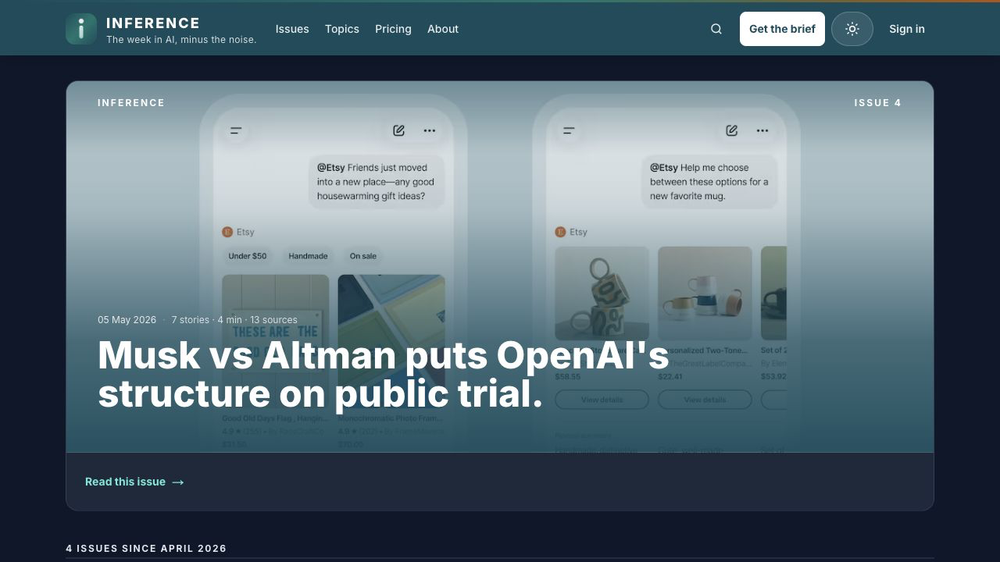
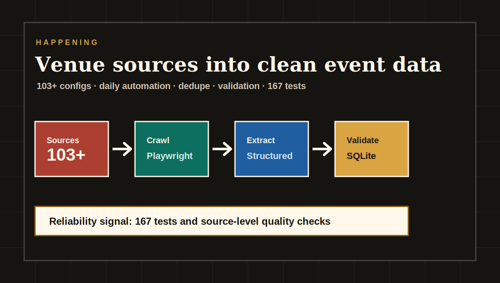
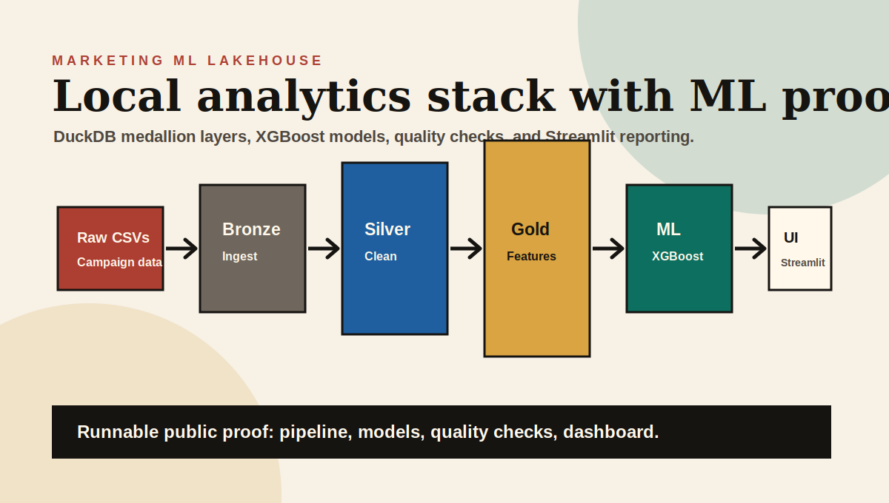
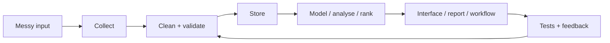

# Matthew Paver

### AI products, data systems, and analytics apps

I build practical systems from messy inputs: crawled websites, scraped listings, raw CSVs, notes, schedules, dashboards, and recommendation data. The pattern is simple: collect the data, clean it, check it, and turn it into something someone can open.

  <a href="https://matthewpaver.github.io/MatthewPaver/store/"><strong>Portfolio Store</strong></a> ·
  <a href="https://inferencebrief.co/"><strong>Live Product</strong></a> ·
  <a href="CASE_STUDIES.md"><strong>Case Studies</strong></a> ·
  <a href="Projects.md"><strong>Project Index</strong></a> ·
  <a href="CV.pdf"><strong>CV</strong></a> ·
  <a href="https://www.linkedin.com/in/matthew-paver-534262166/"><strong>LinkedIn</strong></a>

`Python` `TypeScript` `FastAPI` `Next.js` `DuckDB` `Supabase` `GCP`

---

## Selected Work

<table>
<tr>
<td width="33%" valign="top">
  
  <h3>Inference Brief</h3>
  
Live AI news product with publishing, accounts, bookmarks, history, preferences, and a working reader experience.

  
<code>Next.js</code> <code>TypeScript</code> <code>Supabase</code> <code>Python</code>

  
<a href="https://inferencebrief.co/">Open product</a>

</td>
<td width="33%" valign="top">
  
  <h3>Happening</h3>
  
Private ingestion system turning 103+ London venue sources into structured event data with crawling, dedupe, checks, and tests.

  
<code>Python</code> <code>Playwright</code> <code>SQLite</code> <code>Pydantic</code>

  
<a href="CASE_STUDIES.md#happening">Read case study</a>

</td>
<td width="33%" valign="top">
  
  <h3>Marketing ML Lakehouse</h3>
  
Public, runnable data app with DuckDB, quality checks, XGBoost training, and Streamlit reporting.

  
<code>Python</code> <code>DuckDB</code> <code>XGBoost</code> <code>Streamlit</code>

  
<a href="https://github.com/MatthewPaver/marketing-ml-lakehouse">Inspect repo</a>

</td>
</tr>
</table>

Open the [Portfolio Store](https://matthewpaver.github.io/MatthewPaver/store/) for the full app-store view across live products, private systems, public repos, credentials, and archived experiments.

---

## Credentials

<table>
<tr>
<td width="25%" valign="top">
  
   
  AI and cloud fundamentals
</td>
<td width="25%" valign="top">
  
   
  Cloud architecture foundations
</td>
<td width="25%" valign="top">
  
   
  Graph data modelling
</td>
<td width="25%" valign="top">
  
   
  Agent workflows and evaluation
</td>
</tr>
<tr>
<td width="25%" valign="top">
  
   
  Automation and RPA delivery
</td>
<td width="25%" valign="top">
  
   
  Professional IT foundations
</td>
<td width="25%" valign="top">
  
   
  Core systems and practice
</td>
<td width="25%" valign="top">
  
   
  Full background and experience
</td>
</tr>
</table>

---

## What I Build

| Area | Plain-English version | Examples |
|:---|:---|:---|
| AI products | AI inside a usable workflow, not just a prompt demo | [Inference Brief](https://inferencebrief.co/), [AI Study Companion](CASE_STUDIES.md#ai-study-companion) |
| Data systems | Messy sources turned into clean, repeatable datasets | [Happening](CASE_STUDIES.md#happening), [Marketing ML Lakehouse](https://github.com/MatthewPaver/marketing-ml-lakehouse) |
| Automation | Scheduled jobs with checks and visible outputs | Happening checks, newsletter tools, scrape monitors |
| Analytics apps | Analysis packaged into something people can use | [ProjectLens](https://github.com/MatthewPaver/ProjectLens), HR dashboards |
| ML projects | Ranking, embeddings, forecasting, and generation | Recommendation systems, Architexa, sentence similarity |

---

## Project Index

| Project | Type | What it does |
|:---|:---|:---|
| [Inference Brief](https://inferencebrief.co/) | Live product | Curated AI-news reader with issue publishing, accounts, bookmarks, history, and preferences |
| [Happening](CASE_STUDIES.md#happening) | Private system | 103+ venue sources normalised into structured London event data with scheduled checks |
| [Marketing ML Lakehouse](https://github.com/MatthewPaver/marketing-ml-lakehouse) | Public repo | DuckDB lakehouse with model training, quality checks, and Streamlit reporting |
| [AI Study Companion](CASE_STUDIES.md#ai-study-companion) | Private product | Document upload, generated flashcards/quizzes/study plans, and spaced repetition |
| [ProjectLens](https://github.com/MatthewPaver/ProjectLens) | Public repo | Project schedule upload, slippage analysis, milestone pressure, and reporting outputs |
| [Dating App Recommendation System](https://github.com/MatthewPaver/dating-app-recommendation-system) | Public repo | Implicit-feedback recommender with 3.4M+ interactions and temporal evaluation |

More repos

| Repo | What to look at |
|:---|:---|
| [Architexa](https://github.com/MatthewPaver/Architexa) | Conditional GAN, image-generation API, dataset pipeline |
| [sentence-similarity-analysis](https://github.com/MatthewPaver/sentence-similarity-analysis) | Sentence-transformer embeddings and cosine similarity caveats |
| [pyspark-kafka-streaming](https://github.com/MatthewPaver/pyspark-kafka-streaming) | Compact Kafka and PySpark streaming examples |
| [hr-performance-dashboards](https://github.com/MatthewPaver/hr-performance-dashboards) | Power BI dashboards, prepared CSVs, screenshots, and stakeholder notes |

---

## Build Pattern

The strongest work is the whole loop: not just the model, not just the dashboard, not just the script. The data path should be repeatable, the output should be easy to inspect, and failures should be visible.
