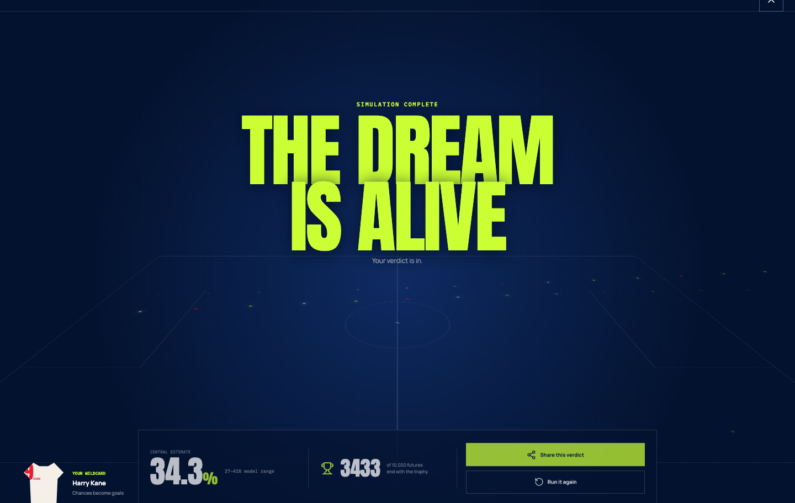
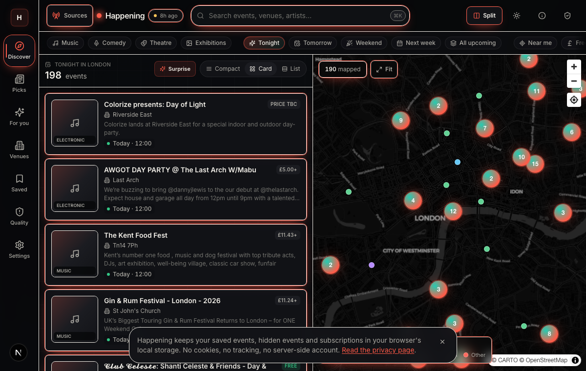
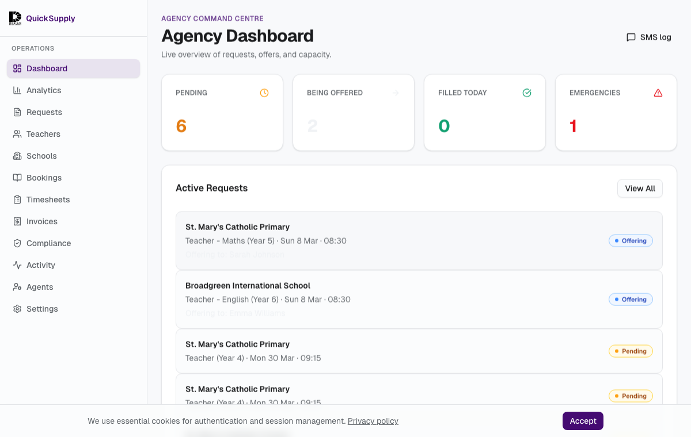
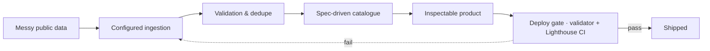

  

  
  

  
  

---

## Featured products

<table>
<tr>
<td width="33%" valign="top">
  
  <h3>Can England Win It? · live</h3>
  
A playable World Cup probability lab: make three matchday calls and run 10,000 tournament futures.

  
<code>React</code> <code>TypeScript</code> <code>Vite</code> <code>Vitest</code> <code>Monte Carlo</code>

  
<a href="https://matthewpaver.github.io/can-england-win-it/">Play live ↗</a> · <a href="CASE_STUDIES.md#product-case-study-can-england-win-it">Case study ↗</a> · <a href="https://github.com/MatthewPaver/can-england-win-it">Repo ↗</a>

</td>
<td width="33%" valign="top">
  
  <h3>Happening · private</h3>
  
Venue pages turned into structured event data, with source configs, scheduled runs, and a 167-test reliability suite.

  
<code>Python</code> <code>Playwright</code> <code>SQLite</code> <code>Pydantic</code> <code>GitHub Actions</code>

  
<a href="https://matthewpaver.github.io/MatthewPaver/store/preview.html?app=happening">Preview ↗</a> · <a href="CASE_STUDIES.md#featured-build-happening">Case study ↗</a>

</td>
<td width="33%" valign="top">
  
  <h3>QuickSupply · private MVP</h3>
  
A school cover-ops workflow built for three sides: school, agency, teacher. Sequential assignment, compliance checks, live status.

  
<code>Next.js</code> <code>TypeScript</code> <code>PostgreSQL</code> <code>Drizzle</code> <code>SSE</code>

  
<a href="https://matthewpaver.github.io/MatthewPaver/store/preview.html?app=quicksupply">Preview ↗</a>

</td>
</tr>
</table>

## At a glance

| | |
|:---|:---|
| **Role**     | Software engineer and automation specialist |
| **Based**    | London |
| **Focus**    | Automation, data products, AI workflows, analytics tools |
| **Shipping** | Project 1966 (live simulator) · Happening (private venue-ingestion system) · QuickSupply (private MVP) |
| **Stack**    | Python · TypeScript · FastAPI · Next.js · Postgres / DuckDB · Playwright · GitHub Actions |
| **Specs**    | [Constitution](.specify/memory/constitution.md) · [Feature spec](specs/001-portfolio-store-reliability/spec.md) · [Validator](scripts/validate-store.mjs) · [Lighthouse CI](.lighthouserc.json) |

## Build pattern

The pattern is practical: collect the messy input, clean it, check it, and turn it into something you can open. The [portfolio store](https://matthewpaver.github.io/MatthewPaver/store/) follows the same habit: indexed catalogue, validator, Lighthouse CI, no framework, no build step.

## Open these next

<table>
<tr>
<td valign="top" width="50%">

**▸ Runnable applications**

- [Marketing ML Lakehouse](https://github.com/MatthewPaver/marketing-ml-lakehouse) — Bronze/silver/gold DuckDB flow, XGBoost training, data-quality checks, Streamlit dashboard  
- [ProjectLens](https://github.com/MatthewPaver/ProjectLens) — Schedule-risk Flask app: upload, slippage analysis, milestone pressure, Power BI-ready exports  
<strong>Repo standard:</strong> run command, tests or checks, demo/sample data where possible, screenshots, architecture notes, and limitations.

**▸ Analytics handoff**

- [HR Performance Analytics](https://github.com/MatthewPaver/hr-performance-dashboards) — Power BI dashboard package: PBIX files, dashboard previews, methodology PDF, stakeholder commentary  

</td>
<td valign="top" width="50%">

**▸ Notebook demos and technical examples**

- [Dating App Recommendation System](https://github.com/MatthewPaver/dating-app-recommendation-system) — Implicit-feedback ranking with temporal holdouts and Top-K metrics  
- [Sentence Similarity Analysis](https://github.com/MatthewPaver/sentence-similarity-analysis) — Embedding retrieval with a deliberate point about similarity not being truth  
- [PySpark Kafka Streaming](https://github.com/MatthewPaver/pyspark-kafka-streaming) — DataFrames, Structured Streaming, JSON event production  

</td>
</tr>
</table>

## Credentials

  
  
  
  
  
  
  

<strong>Latest public activity</strong> (auto-updated daily)

<!-- AUTO:ACTIVITY_START -->
## Latest Public Activity (Auto-Updated)

_This section is automatically refreshed by GitHub Actions._

- Last refresh (UTC): 2026-07-16 09:30

| Repo | Last push | What it is |
|:---|:---:|:---|
| [MatthewPaver.github.io](https://github.com/MatthewPaver/MatthewPaver.github.io) | 2026-07-15 | Live apps, open-source tools and private product pilots by Matthew Paver |
| [MatthewPaver](https://github.com/MatthewPaver/MatthewPaver) | 2026-07-15 | Portfolio: AI products, data systems, ML, and analytics — every project has a preview,… |
| [ProjectLens](https://github.com/MatthewPaver/ProjectLens) | 2026-07-15 | Evidence-bound project change assurance: check the pack, record the human decision, tra… |
| [DecisionGraph](https://github.com/MatthewPaver/DecisionGraph) | 2026-07-15 | Evidence-linked project decision memory and comparable-case retrieval demo |
| [paper-trading-bot](https://github.com/MatthewPaver/paper-trading-bot) | 2026-07-15 | Evidence-first paper-trading research engine with reproducible backtests, risk controls… |
| [happening-open-core](https://github.com/MatthewPaver/happening-open-core) | 2026-07-15 | Evidence-aware event schemas and reproducible source-coverage benchmarks |

<!-- AUTO:ACTIVITY_END -->

  Built and maintained by Matthew Paver — <a href="https://github.com/MatthewPaver/MatthewPaver">github.com/MatthewPaver</a>

