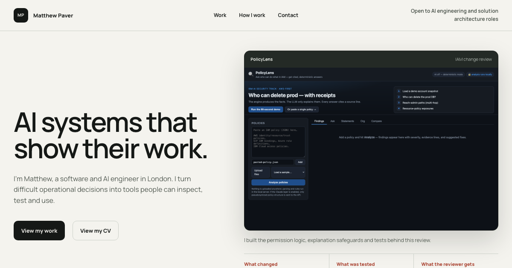

# Matthew Paver

I’m a software and AI engineer based in London. I turn difficult operational decisions into tools that show what changed, what was checked and what a person should review next.

My strongest work sits where AI engineering, data quality and solution architecture meet: rules where the answer should be deterministic, evaluation where models can drift, and clear evidence at the decision boundary.

I’m open to AI engineering and solution architecture roles where reliability, evaluation and delivery matter.

[View my portfolio](https://matthewpaver.github.io/) · [View my CV](CV.pdf) · [LinkedIn](https://www.linkedin.com/in/matthew-paver-534262166/) · [Read the case studies](CASE_STUDIES.md)

## If you have five minutes

These three projects best show how I move from an operational problem to a tested, reviewable product.

| Project | The job | Evidence |
|:---|:---|:---|
| [PolicyLens](https://github.com/MatthewPaver/iam-policy-auditor) | See who gains sensitive cloud access before approving a change | Deterministic reachability, cited statements, correction verification, 55 documented boundary cases and adversarial AI evals |
| [ProjectLens](https://github.com/MatthewPaver/ProjectLens) | Check whether a change pack agrees with its Primavera schedule | [Browser demo](https://matthewpaver.github.io/ProjectLens/change-assurance.html), source-linked findings, decision record and fail-closed precedent RAG |
| [QuickSupply](https://github.com/MatthewPaver/QuickSupply) | Replace phone-and-spreadsheet supply-cover booking with a visible handoff | Public state model, migrations, Playwright tests and a [recorded walkthrough](https://matthewpaver.github.io/preview.html?app=quicksupply) |

## More public work

| Project | What it demonstrates |
|:---|:---|
| [Winchester House Hunter](https://github.com/MatthewPaver/winchester-buyer-check) | Helps a buyer compare Winchester listings using affordability, commute and public sold-price evidence |
| [Marketing ML Lakehouse](https://github.com/MatthewPaver/marketing-ml-lakehouse) | Gives a marketing lead a next-day campaign watchlist backed by reproducible source checks and model evaluation |
| [HR Performance Analytics](https://github.com/MatthewPaver/hr-performance-dashboards) | A reproducible Power BI handoff using Microsoft AdventureWorks data |
| [Can England Win It?](https://github.com/MatthewPaver/can-england-win-it) | A finished one-day simulation and animation experiment with a written postmortem |

## Reusable templates

- [RAG retrieval and answer evaluation](https://github.com/MatthewPaver/sentence-similarity-analysis): relevance, citation coverage and grounded-answer checks.
- [PySpark and Kafka data contracts](https://github.com/MatthewPaver/pyspark-kafka-streaming): validation, quarantine, watermarks, deduplication and window metrics.
- [Offline recommender evaluation](https://github.com/MatthewPaver/dating-app-recommendation-system): popularity baseline, temporal holdouts, Top-K metrics and coverage.

## How I work

I use deterministic checks where rules exist, evaluation sets where models can drift, and a person at the decision boundary. Public repositories include a runnable path, fixtures, tests and stated limits.

**Core stack:** Python · TypeScript · Node.js · React · FastAPI · DuckDB · PostgreSQL · PySpark · Playwright · GitHub Actions

**Credentials:** AWS Cloud Practitioner · AWS AI Practitioner · Neo4j Certified Professional · Hugging Face AI Agents · UiPath RPA Developer · BCS Diploma in IT
