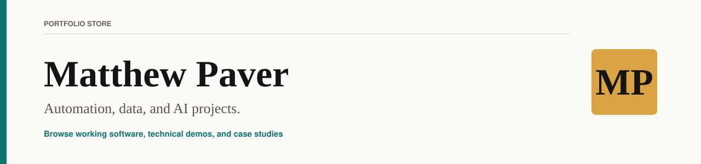
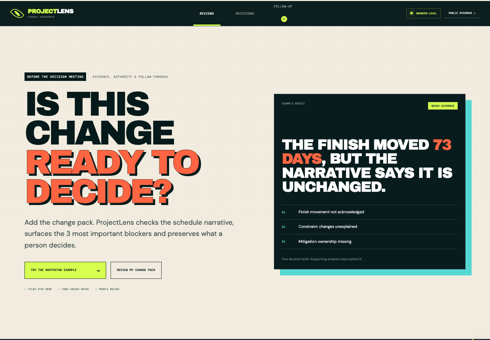
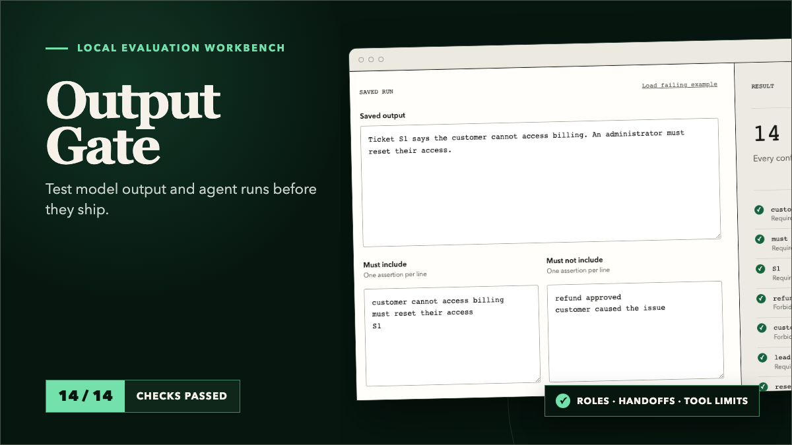
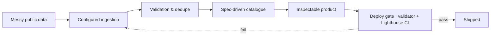

  

  
  
  

  
  

---

**Check the evidence before you approve, send or ship.** I build human-in-the-loop tools for the decisions teams get wrong under pressure — board approvals and AI releases. Try one below; the demos run in your browser on synthetic data.

## Featured products

<table>
<tr>
<td width="33%" valign="top">
  
  <h3>ProjectLens · live</h3>
  
Compare a change pack with its schedule before the board meeting: the three largest conflicts, source dates and a recorded board response.

  
<code>Python</code> <code>Playwright</code> <code>GitHub Pages</code> <code>UK GMPP data</code>

  
<a href="https://matthewpaver.github.io/ProjectLens/change-assurance.html">Use the tool ↗</a> · <a href="https://matthewpaver.github.io/preview.html?app=projectlens">Product notes ↗</a> · <a href="https://github.com/MatthewPaver/ProjectLens">Repo ↗</a>

</td>
<td width="33%" valign="top">
  
  <h3>Output Gate · live</h3>
  
Catch known AI-output regressions before release: required and banned phrases, checked in the browser or CI, no model call needed.

  
<code>Python</code> <code>GitHub Actions</code> <code>JSON</code>

  
<a href="https://matthewpaver.github.io/ai-workflow-evaluator/app/">Use the tool ↗</a> · <a href="https://matthewpaver.github.io/preview.html?app=ai-evaluator">Product notes ↗</a> · <a href="https://github.com/MatthewPaver/ai-workflow-evaluator">Repo ↗</a>

</td>
</tr>
</table>

Also private / parked: Happening (event ingestion — paused), QuickSupply (school cover MVP). Study demos archived on GitHub Aug 2026.

## At a glance

| | |
|:---|:---|
| **Role**     | Product engineer |
| **Based**    | London |
| **Focus**    | Human-in-the-loop decision tools, data products, applied AI |
| **Shipping** | ProjectLens · Output Gate |
| **Stack**    | Python · TypeScript · FastAPI · Next.js · Postgres / DuckDB · Playwright · GitHub Actions |
| **Specs**    | [Constitution](.specify/memory/constitution.md) · [Feature spec](specs/001-portfolio-store-reliability/spec.md) · [Validator](scripts/validate-store.mjs) · [Lighthouse CI](.lighthouserc.json) |

## Build pattern

```mermaid
flowchart LR
    A[Messy public data] --> B[Configured ingestion]
    B --> C[Validation & dedupe]
    C --> D[Spec-driven catalogue]
    D --> E[Inspectable product]
    E --> F[Deploy gate · validator + Lighthouse CI]
    F -.->|fail| B
    F -->|pass| G[Shipped]
```

The pattern is practical: collect the messy input, clean it, check it, and turn it into something a person can use. [Project Evidence Desk](https://matthewpaver.github.io/ProjectLens/board-readiness.html) applies that pattern to the evidence before, during and after a project-board decision; the [project catalogue](https://matthewpaver.github.io/) exposes the engineering underneath.

## Open these next

<table>
<tr>
<td valign="top" width="50%">

**▸ Runnable applications**

- [Marketing ML Lakehouse](https://github.com/MatthewPaver/marketing-ml-lakehouse) — Bronze/silver/gold DuckDB flow, XGBoost training, data-quality checks, Streamlit dashboard  
- [ProjectLens](https://github.com/MatthewPaver/ProjectLens) — Browser-local board readiness: reconcile five evidence groups, expose source-linked findings, record human authority and follow approval conditions  
- [DecisionGraph](https://github.com/MatthewPaver/DecisionGraph) — Comparable project cases with inspectable retrieval, problem-to-outcome evidence chains and human review
<strong>Repo standard:</strong> run command, tests or checks, demo/sample data where possible, screenshots, architecture notes, and limitations.

**▸ Analytics handoff**

- [HR Performance Analytics](https://github.com/MatthewPaver/hr-performance-dashboards) — Power BI dashboard package: PBIX files, dashboard previews, methodology PDF, stakeholder commentary  

</td>
<td valign="top" width="50%">

**▸ Notebook demos and technical examples**

- [Sentence Similarity Analysis](https://github.com/MatthewPaver/sentence-similarity-analysis) — Embedding retrieval with a deliberate point about similarity not being truth  
- [PySpark Kafka Streaming](https://github.com/MatthewPaver/pyspark-kafka-streaming) — DataFrames, Structured Streaming, JSON event production  

</td>
</tr>
</table>

## Credentials

  
  
  
  
  
  
  

<strong>Latest public activity</strong> (auto-updated daily)

<!-- AUTO:ACTIVITY_START -->
## Latest Public Activity (Auto-Updated)

_This section is automatically refreshed by GitHub Actions._

- Last refresh (UTC): 2026-08-20 07:58

| Repo | Last push | What it is |
|:---|:---:|:---|
| [MatthewPaver](https://github.com/MatthewPaver/MatthewPaver) | 2026-08-19 | Portfolio: AI products, data systems, ML, and analytics — every project has a preview,… |
| [MatthewPaver.github.io](https://github.com/MatthewPaver/MatthewPaver.github.io) | 2026-08-11 | Live demos and open-source tools by Matthew Paver |
| [NVG-Crestovian-Analytics](https://github.com/MatthewPaver/NVG-Crestovian-Analytics) | 2026-08-11 | Private take-home assessment submission for authorised reviewers |
| [ProjectLens](https://github.com/MatthewPaver/ProjectLens) | 2026-08-05 | Evidence-bound project change assurance: check the pack, record the human decision, tra… |
| [dating-app-recommendation-system](https://github.com/MatthewPaver/dating-app-recommendation-system) | 2026-08-05 | Swipe-style recommendation system with implicit feedback, temporal holdouts, and Top-K… |
| [sentence-similarity-analysis](https://github.com/MatthewPaver/sentence-similarity-analysis) | 2026-08-05 | Sentence-transformer notebook showing embedding similarity, cosine ranking, and retriev… |

<!-- AUTO:ACTIVITY_END -->

  Built and maintained by Matthew Paver — <a href="https://github.com/MatthewPaver/MatthewPaver">github.com/MatthewPaver</a>

