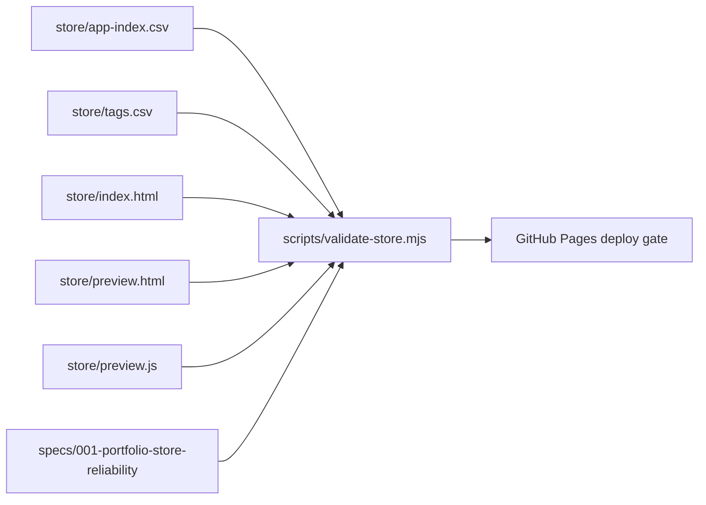

# Implementation Plan: Portfolio Store Reliability

## Technical Context

- Site type: Static HTML/CSS/JavaScript served by GitHub Pages.
- Runtime: No client framework, no bundler.
- Validation: Node script run via `npm test`.
- Deploy: GitHub Actions Pages workflow.

## Architecture

## Decisions

### D1: Keep the portfolio store static

Rationale: The current requirements are navigation, presentation, previews, and validation. A static site is sufficient and reduces deployment and maintenance risk.

### D2: Use CSV for catalogue data

Rationale: The project catalogue should remain easy to inspect in GitHub and simple enough to validate without dependencies. CSV is adequate for the current shape.

### D3: Progressive enhancement over JavaScript-only routing

Rationale: The reported Chrome/no-JS issue is a routing concern. Category links must work as links first; JavaScript should only enhance filtering and scrolling.

### D4: Validate spec artifacts in the same command as store data

Rationale: If specs are the source of truth, CI must fail when required spec artifacts are absent or unresolved.

## Implementation Phases

### Phase 1: Specification source of truth

- Add project constitution.
- Add feature specification.
- Add implementation plan, tasks, quickstart, research, and contracts.

### Phase 2: Browser-compatible implementation

- Add no-JS and js-enabled mode.
- Hide JS-only controls without scripts.
- Make shelf URLs normal links to the project grid.
- Add preview no-JS fallback.

### Phase 3: Validation

- Extend `scripts/validate-store.mjs` to validate catalogue, preview, progressive enhancement, and spec artifacts.
- Run validation locally.
- Run validation in GitHub Pages workflow.

## Complexity Tracking

No additional libraries, bundlers, app frameworks, or build steps were added. Complexity is limited to static artifacts and a dependency-free validation script.
